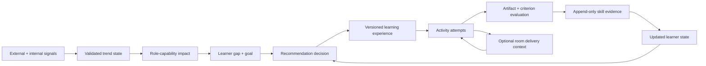

# SkillGap AI Learning System Audit

**Date:** 2026-08-27  
**Auditor posture:** Principal AI engineer + product systems architect  
**Scope:** Product truth, AI architecture, deployed data, learning science, personalization, evidence integrity, rooms, reliability, evaluation, and execution sequence  
**Verdict confidence:** High on code and deployed schema; medium on production operations because Vercel environment and OpenAI billing/trace data were not available

---

## Executive verdict

### Ruthless grade

- **Vision quality:** 8.5/10
- **Reusable engineering foundation:** 6.2/10
- **System integration:** 3.4/10
- **Deployed user experience versus the vision:** 3.0/10
- **Overall:** **3.6/10 — promising parts, not yet the promised product**

SkillGap is not building a bad idea. It is building several good subsystems that do not yet operate as one learning system.

The intended product is:

> Detect what matters now, understand this professional, identify the next useful capability gap, compile a current and tailored learning experience, help them practice in real work, evaluate evidence, update their learner model, and recommend the next best action. Rooms are an optional social delivery context for that same loop.

The product a user receives today is materially different:

> Pick from five Marketing missions, complete one generated Do task inside a room, receive coarse AI feedback and a skill receipt, then move through a fixed editorial sequence.

That can be a valid narrow MVP. It is not yet a current, personalized, rich-media AI learning platform. The current product language and profile presentation occasionally imply more verification, market intelligence, and personalization than the system has earned.

### The most important conclusion

**Do not add more surfaces or more mission inventory next. Close one complete intelligence-to-learning-to-evidence loop.**

The standalone Message Review lab should stop receiving product-surface investment. Its deterministic review, structured-output, fail-closed, and eval patterns are valuable. Reuse those patterns inside a real learning path. The lab is a component and test bed, not the center of SkillGap.

---

## What was audited

This audit used five forms of evidence:

1. **Product strategy**
   - `STRATEGY_Foundation.md`
   - `PRD_Golden_Path.md`
   - `PRD_Real_Work_Value_Loop.md`
   - `LAUNCH_GATE_RESULT.md`
   - prior `AUDIT.md`

2. **Static code inspection**
   - Signal ingestion, topic clustering, content scoring, content lake, curriculum generation
   - Onboarding, learner state, skills, recommendations, progress, assessment, receipts
   - MissionBriefV2 generation and legacy projection
   - Rooms, presence, synthetic users, host prompts, mission handoff
   - LLM call sites, safety, schemas, rate limits, timeouts, retries, and evals

3. **Read-only deployed Supabase inspection**
   - Correct SkillGap project: `lipdyycqbuvibgxcckjd`
   - Table inventory and row counts
   - Migration ledger
   - Constraints
   - Security and performance advisors
   - Aggregate pipeline and learning-loop health queries
   - No production data was changed

4. **Authenticated browser smoke test**
   - `/missions`
   - Active mission briefing
   - `/progress`
   - Local Next.js app at `http://localhost:3000`

5. **Automated repository checks**
   - TypeScript
   - Vitest
   - ESLint

### Limitations

- I did not inspect Vercel deployment settings, cron delivery logs, or environment variables.
- I did not inspect OpenAI account spend, rate-limit telemetry, or request traces because the app does not persist them.
- I did not run a human learning-outcomes study. There is no production cohort large enough to establish efficacy.
- The database has two profiles, so behavioral conclusions cannot be generalized.
- The workspace contains substantial uncommitted work. This audit reflects the repository and database state observed on 2026-08-27.

---

## The product contract SkillGap should satisfy

Every recommendation should be able to answer six questions from stored, inspectable evidence:

1. **Why now?**  
   Which current signals establish that this topic or capability matters?

2. **Why this learner?**  
   Which role context, goal, skill state, prior evidence, or workflow makes it relevant?

3. **Why this learning experience?**  
   Which objective does each source, activity, check, and artifact serve?

4. **What changes after completion?**  
   Which professional capability should improve, at what expected depth?

5. **How will SkillGap know?**  
   Which observable evidence, rubric, transfer task, or later use supports the update?

6. **What should happen next?**  
   How does the new evidence change the next recommendation?

Today, SkillGap can answer pieces of these questions in separate modules. It cannot produce one authoritative trace joining all six.

---

## Deployed reality: the numbers that matter

### Intelligence loop

Observed in the live SkillGap database:

- `fp_signals`: **850**
- Unprocessed signals: **850**
- Signals linked to a topic cluster: **0**
- Duplicate `(source, source_id)` groups: **241**
- `fp_topic_clusters`: **0**
- `fp_skill_market_state`: **0**
- `fp_internal_demand_events`: **0**
- Last signal collection run: **2026-03-14**
- Latest signal timestamp: **2026-03-14**

The repository schedules signal collection every 15 minutes and clustering hourly in `vercel.json:16-21`. The database shows no evidence that this closed loop has operated since March and no evidence that clustering has ever produced a live cluster in this project.

The cause is not proven by this audit. Plausible causes include cron deployment/auth configuration, an old deployment, or the runtime pointing at a different environment. The observable fact is narrower and sufficient:

**The deployed database does not currently support the claim that SkillGap is monitoring the AI world and converting it into live learning priorities.**

### Content

- Break candidates: **1,283**
- Break scores: **600**
- Content-lake items: **202**
  - Videos: **190**
  - Articles: **12**
- Latest video-lake update: **2026-03-18**
- Latest article-lake update: **2026-03-22**

The content infrastructure is real, but the learning lake was roughly five months stale at audit time. A current-learning product cannot treat this as a secondary operational detail. Currentness is part of the value proposition.

### Learning paths

- `fp_learning_paths`: **1,393**
- Legacy rows with no `generation_engine`: **1,388**
- Mission projection rows: **5**
- Rows carrying both function and fluency adaptation: **24** (**1.7%**)
- Adapted rows created after March: **0**
- Generation-status runs: **35**, all complete, last observed **2026-03-20**

All five visible launch missions have:

- one item
- one `do` task
- zero `watch` tasks
- zero `check` tasks
- zero `reflect` tasks
- zero modules
- no function-adaptation field
- no fluency-adaptation field

The database contains a large path inventory, but inventory is not the same as a learning system. Most rows have no explicit generation-engine lineage. The visible catalog intentionally hides almost all of them, which is honest, but also confirms that the dynamic engine is not the primary experience.

### Learner evidence

- Profiles: **2**
- Learning-progress rows: **23**
- Completed progress rows: **3**
- Achievements: **3**
- Achievements with skill receipts: **3**
- User-skill aggregate rows: **7**
- Product events: **25**

The data proves that the golden path can complete and issue receipts. It does not establish that the receipts measure durable capability, transfer, or real-world impact.

### Schema governance

- Local migration files: **39**
- Migrations recorded in the deployed migration ledger: **8**
- No generated Supabase database types were found.
- Several runtime tables have no reproducible `CREATE TABLE` migration in the repository.

The live database is effectively part of the source code, but it is not versioned with the same discipline as the TypeScript. That is a serious scaling and trust problem.

---

## Ruthless scorecard

### 1. World intelligence and currentness — 2.0/10

**What is good**

- Multi-source collectors exist for Reddit, Hacker News, RSS, YouTube velocity, and internal demand.
- The topic taxonomy is DB-backed and supports aliases and matching.
- Heat calculation includes decay.
- Topic-to-skill mapping exists.
- Content discovery, scoring, safety, and editorial shelving are substantial.

**What fails**

- Every deployed signal is unprocessed.
- No signal is linked to a cluster.
- No topic cluster or skill-market row exists.
- Internal-demand instrumentation is explicitly unfinished in `lib/signals/internalCollector.ts:1-8`.
- The code claims deduplication by `(source, source_id)` in `lib/signals/insertSignals.ts:67-106`, but the deployed table has no matching unique constraint. The database contains 241 duplicate key groups.
- Hot-topic discovery does not guarantee evaluation and lake indexing.
- Pending topics are not promoted into the active classification taxonomy automatically or through a visible operating queue.
- Content-lake freshness stopped in March.

**User consequence**

“Why now?” is mostly editorial copy, not a live, inspectable conclusion from current signals.

**Required correction**

Make one trend travel from source signal to approved topic state, curated content, role impact, and path candidate with full lineage. Do not claim currentness until that trace runs continuously and alerts when stale.

---

### 2. Professional capability graph — 4.5/10

**What is good**

- The strategy’s Skills × Functions × Fluency model is directionally strong.
- The database has 100 canonical topics, 72 skills, 8 skill domains, and 70 topic-to-skill mappings.
- Skill relevance by function exists.
- The recommendation engine has sensible strategy categories.

**What fails**

- Topics and skills remain two loosely connected taxonomies.
- `fp_topic_skill_map` uses slugs without foreign keys to either canonical table.
- `fp_skill_tags.path_id` has no deployed foreign key to `fp_learning_paths`.
- The visible launch paths rely on hand-authored lane-to-skill tags.
- There is no production micro-skill graph with prerequisite, overlap, transfer, or evidence rules.
- There is no role-capability model detailed enough to answer what a product marketer at a B2B SaaS company should do differently from a lifecycle marketer, content marketer, or demand-generation lead.

**User consequence**

Function labels contextualize copy, but they do not yet produce a defensible professional gap diagnosis.

**Required correction**

Model role applications separately from portable skills:

- portable capability
- role-specific application
- observable behavior
- prerequisite capability
- target fluency rubric
- evidence types that can update the state

Do not introduce neural knowledge tracing yet. First create clean, append-only evidence data and an interpretable confidence model.

---

### 3. Learner model — 3.0/10

**What is good**

- Profiles store primary function, secondary functions, and self-reported fluency.
- `fp_user_skills` stores demonstrated-skill aggregates.
- Curriculum prompt adaptation can consume current skill rows.

**What fails**

- Onboarding does not capture a concrete 30-day outcome, current work, tool stack, company context, constraints, or preferred mode.
- Self-reported profile fluency and demonstrated per-skill fluency are separate and not reconciled.
- Skill rows are mutable aggregates, not a history of evidence.
- There is no confidence, uncertainty, decay, recency weighting, evidence diversity, or abstention state.
- A correct or accepted submission is treated as homogeneous evidence. Attempt count, support used, hint use, prior exposure, time, and later transfer are not modeled.
- There is no durable learner-goal object connected to generation and recommendation.

**User consequence**

The system knows a label such as “Marketing / Practicing.” It does not know the professional well enough to choose the highest-value next capability.

**Required correction**

Create an append-only evidence stream and derive learner state from it:

- `skill_evidence_event`
- capability or micro-skill
- source attempt and artifact
- evaluator version
- observed performance
- scaffolding level
- confidence
- occurred-at timestamp
- optional later-use outcome

The learner state should be a materialized interpretation of evidence, not the only record of truth.

---

### 4. Curriculum compiler and rich-media grounding — 4.0/10

**What is good**

- `lib/learn/curriculumGenerator.ts` contains a credible 3–5 module Watch → Do → Check → Reflect compiler.
- It retrieves content, binds real content IDs, applies function/fluency prompt context, assigns tools, and falls back gracefully.
- YouTube handling respects official embeds.
- MissionBriefV2 has a much richer canonical model for framing, artifacts, execution, source references, criteria, inputs, and scaffolding.

**What fails**

- The visible launch flow bypasses the rich curriculum compiler.
- `lib/missions/services/legacyPathProjector.ts:188-242` collapses MissionBriefV2 to one Do item and `modules: null`.
- Inputs, scaffolding, source evidence, rubric dimensions, and multi-step pedagogy are discarded or flattened.
- The live content lake is stale.
- When the lake is thin, `curriculumGenerator.ts:70-130` can feed heuristically filtered, not fully evaluated, YouTube results into path generation.
- Generation deduplication uses function and fluency in memory but checks the database by query only in `app/api/learn/search/generate/route.ts:72-103`. One learner can receive another profile variant.
- The primary missions surface does not expose on-demand tailored generation.

**User consequence**

The codebase can generate the experience described in strategy. The launch product does not deliver it.

**Required correction**

Make one canonical `LearningExperienceVersion` that preserves:

- objective and target capability
- learner-segment snapshot
- why-now evidence
- source assets and source versions
- modules and activities
- scaffolding level
- artifact contract
- rubric
- generation run and prompt version
- approval state

Use an adapter for old `LearningPath` readers while migrating. Do not project rich briefs into a permanently lossy one-item shape.

---

### 5. Learning design and efficacy — 3.5/10

**What is good**

- Renderers exist for Watch, Do, Check, and Reflect.
- Missions use real tools rather than simulations.
- The product asks for an artifact.
- The Message Review lab demonstrates useful progressive disclosure and participant-controlled revision.

**What fails**

- Visible launch missions contain no curated rich media and no checks or reflections.
- There is no pre-task baseline or transfer task.
- There is no delayed retention or real-use check.
- Feedback is usually answer-level, not a sustained tutoring interaction with verification and elaboration at each meaningful step.
- There is no explicit cognitive-load or misconception model.
- The current mission sequence is editorial, not adaptive.
- “Claude Code for marketers” may be valuable for a narrow product-marketing workflow, but the live intelligence system provides no evidence that it is the highest-value first capability for this learner.

**User consequence**

The user may complete useful work, but SkillGap cannot yet show that the person learned a transferable skill rather than followed a prompt once.

**Required correction**

For the first real path:

1. establish a brief baseline
2. teach with one or two high-quality source segments
3. use guided practice
4. require an independent artifact or transfer step
5. provide criterion-level feedback
6. ask for a later work-use check

Recent AI-tutoring evidence supports AI systems when they are deliberately designed around active learning, cognitive load, Socratic guidance, and high-information feedback. Generic chatbot helpfulness is not sufficient.

---

### 6. Assessment, evidence, and credential integrity — 3.8/10

**What is good**

- `/api/learn/evaluate` is authenticated, rate-limited, structured, and fails closed.
- Do tasks cannot complete through Skip after the Golden Path fixes.
- Completion is guarded atomically.
- Receipts require evaluated Do work.
- Achievements and skill receipts persist.

**What fails**

- There are two evaluation paths with different contracts.
- The primary client flow sends an evaluation object back to the progress route; the server does not always re-evaluate the submitted work against a canonical rubric.
- Runtime evaluation does not use MissionBriefV2 rubric dimensions.
- Three labels are converted to fixed pseudo-scores:
  - `nailed_it` → 90
  - `good` → 70
  - `needs_iteration` → 45
- Those numbers are not measurements and should not be treated as calibrated proficiency.
- `fp_learning_progress.item_states` overwrites attempts inside JSONB.
- There is no first-class attempt, artifact, evaluation, criterion result, grader version, or adjudication record.
- There is no human-agreement study for the general learning evaluator.
- The profile displayed “Capability proven through completed work” and “proof of work” for one-step missions completed in roughly one to three minutes. That language outruns the evidence.

**User consequence**

The receipt is evidence that an evaluated interaction occurred. It is not yet defensible evidence of durable professional proficiency.

**Required correction**

Use first-class records:

- artifact
- attempt
- evaluation
- criterion result
- grader and prompt version
- confidence
- abstained or needs-review state
- human adjudication when sampled

Rename public claims until calibrated:

- “Capability practiced” instead of “Capability proven”
- “AI-reviewed against supplied criteria” instead of “verified proficiency”

The evaluator must be allowed to abstain. Uncertainty is a feature, not a failure.

---

### 7. Recommendation and feedback loop — 2.5/10

**What is good**

- `lib/skills/recommendations.ts` has five coherent strategies: momentum, level-up, function gap, market demand, and domain expansion.
- It can read skill state and market state.
- It avoids unnecessary generative calls.

**What fails**

- The primary Missions/Home/Progress surfaces use `lib/useMissionRecommendations.ts`, which delegates to a fixed launch-catalog sequence.
- `lib/missionCatalogRecommendations.ts:188-231` labels every recommendation as `market_demand` even though deployed `fp_skill_market_state` has zero rows.
- The onboarding hero is fixed to `prompt-engineering:research-insight` in `lib/onboarding/catalogPicks.ts:6-39`.
- `trackPathRecommended` is defined but never called.
- There is no recommendation-decision table.
- There are no persisted impressions, alternatives considered, reason features, acceptances, dismissals, or downstream outcomes.
- Completion evidence does not change the primary catalog sequence beyond marking lanes complete.

**User consequence**

“Recommended for you” is mostly an editorial queue, not a next-best-action decision.

**Required correction**

Persist every recommendation decision:

- learner-state snapshot
- candidate set
- eligibility filters
- selected item
- reason codes and feature values
- model/ranker version
- impression
- accept/dismiss
- completion and usefulness outcome

Start with deterministic ranking. Do not add a bandit or learned ranker until there is enough clean outcome data.

---

### 8. Rooms as a delivery context — 4.0/10

**What is good**

- Mission handoff into a room is real.
- The room uses the same progress API and content renderer.
- Session metadata stores mission identity.
- Supabase Presence, timers, activity events, hosts, and synthetic systems are substantial.

**What fails**

- There is no shipped solo mission runner. `useLearnProgress` is consumed only by `app/environment/[id]/page.tsx`.
- Mission detail’s primary action is “Start in Room” or “Continue in Room” in `components/missions/MissionDetailPage.tsx:527-572`.
- Mission progress is not represented in the presence payload in `lib/types/presence.ts:14-34`.
- Other participants and the host cannot see which learning step the user is doing.
- Room chat is local state rather than party-scoped realtime.
- Synthetic presence can be presented alongside real users without sufficient user-facing distinction.
- Mission workspace restore and mobile geometry have known weaknesses.
- `/session` and `/environment/[id]` represent parallel social-session products.

**User consequence**

The room is currently a mandatory container around the mission, not an optional social accelerator for the same learning path.

**Required correction**

Ship solo first. Then let the user bring the same active attempt into a room without changing its identity or progress.

Room presence should optionally expose:

- mission or capability
- current step
- progress band
- help or pairing intent

Do not expose private artifact content by default.

---

### 9. AI engineering, safety, cost, and reliability — 5.0/10

**What is good**

- Model choice is consistent with project rules: `gpt-4o-mini`.
- Structured JSON outputs are used broadly.
- The content-scoring pipeline layers regex screening, the shared safety prompt, AI scoring, and hard gates.
- Mission generation uses source packets, stable keys, caches, and quality gates.
- The Message Review lab is the strongest AI implementation:
  - untrusted-input framing
  - deterministic checks
  - strict schemas
  - timeouts
  - reconciliation
  - fail-closed behavior
  - fixtures and a comparison harness

**What fails**

- Direct `new OpenAI()` clients and hard-coded models are spread across roughly 30 call-site files.
- There is no shared LLM execution layer.
- No token-usage, latency, cost, request ID, prompt version, cache hit, or evaluator outcome is logged consistently.
- Repository search found no prompt-token or completion-token telemetry.
- Only the Message Review lab applies explicit 20-second OpenAI timeouts. Most calls have no request timeout.
- There is no general retry policy with bounded jitter.
- User-controlled evaluator and host inputs do not consistently use the lab’s untrusted-data isolation pattern.
- In-memory rate limits are not authoritative across Vercel instances.
- Goal-breakdown and next-goal routes are LLM cost surfaces without the same auth and safety discipline.
- Prompt versions exist in isolated modules, not in a common registry.
- There is no continuous, cross-surface AI regression suite.

**User consequence**

Failures, drift, and cost cannot be diagnosed or bounded reliably. A model change can alter learning quality without a release gate.

**Required correction**

Introduce one internal AI gateway:

- call-site ID
- task and prompt version
- pinned model snapshot when available
- schema
- timeout
- bounded retry policy
- input/output hashes
- token usage
- estimated cost
- latency
- cache status
- outcome and error category
- optional learner-safe trace ID

Reuse the Message Review deterministic + model + validator pattern for all consequential evaluation.

---

### 10. Data architecture and operations — 4.0/10

**What is good**

- Mission source packets, briefs, generation runs, editorial decisions, and projections have the strongest lineage model in the codebase.
- Progress completion is idempotent.
- Receipt snapshots preserve before/after states.
- RLS is enabled broadly.

**What fails**

- The migration ledger and repository migration set diverge sharply.
- The database cannot be confidently rebuilt from the repository alone.
- Types are hand-maintained instead of generated from Supabase.
- Attempts and artifacts are not first-class.
- Recommendation decisions are ephemeral.
- The content lake and break shelf are parallel asset systems.
- Code writes to `fp_content_performance`, `fp_room_performance`, and `fp_score_calibrations`, but those tables do not exist in the deployed database.
- The signal uniqueness assumption is not enforced.
- Some slug bridges have no foreign keys.
- Supabase advisors report callable `SECURITY DEFINER` functions for `anon` and `authenticated`, mutable function search paths, and the vector extension in `public`.

The advisor findings are warnings, not proof of exploitation. They require a dedicated security pass before public scale:

- [Publicly executable SECURITY DEFINER functions](https://supabase.com/docs/guides/database/database-linter?lint=0028_anon_security_definer_function_executable)
- [Mutable function search paths](https://supabase.com/docs/guides/database/database-linter?lint=0011_function_search_path_mutable)
- [Extensions in the public schema](https://supabase.com/docs/guides/database/database-linter?lint=0014_extension_in_public)

**User consequence**

The product cannot reliably learn from its own behavior if its events, attempts, and schema lineage are incomplete or non-reproducible.

---

### 11. Product coherence and UX truth — 4.0/10

The authenticated browser showed a polished but narrow experience:

- Missions presents an editorial “launch path.”
- The active mission was “Create a Message Matrix for Claude Code.”
- The briefing asks for one internal value matrix.
- The primary continuation is into a room.
- The profile presents “Capability proven through completed work.”
- Completed one-step missions were shown as proof after approximately one to three minutes.

The UX is clearer after the Golden Path work, but the system narrative is still internally inconsistent:

- Strategy says tailored learning paths with curated media.
- The primary experience is five single-task launch missions.
- Profile language suggests verified capability.
- Recommender labels suggest live market demand.
- The live intelligence and learner-evidence layers do not support those claims.

The cleanest correction is not more copy. It is aligning the product objects behind the copy.

---

## The five competing product realities in the repository

SkillGap currently contains five partially independent systems:

1. **Static launch sequence**
   - Five Marketing mission projections
   - Fixed onboarding hero
   - Fixed next-lane progression

2. **Legacy dynamic learning paths**
   - 1,388 rows with no generation-engine lineage
   - 3–5 module compiler exists
   - Mostly hidden from the launch catalog

3. **MissionBriefV2 factory**
   - Strong source-packet and editorial lineage
   - Rich artifacts and criteria
   - Collapsed into a single Do task for runtime

4. **Skill recommendation engine**
   - Sensible evidence-oriented strategies
   - Not used by the primary Missions/Home experience

5. **Rooms/focus system**
   - Presence, timers, hosts, breaks, goals, synthetics
   - Learning progress is an overlay rather than the room’s shared semantic model

The central architecture job is to make these one system, not to make each system more elaborate.

---

## Target architecture

### Canonical loop

### What AI should and should not own

**Use LLMs for**

- semantic classification
- role-impact synthesis
- curriculum drafting
- contextual explanation
- artifact feedback
- candidate-generation breadth

**Use deterministic or statistical systems for**

- deduplication
- freshness and decay
- eligibility
- source lineage
- schema and rubric validation
- completion
- skill-state updates
- recommendation reason traces
- cost and rate limits

**Require human approval for**

- new canonical topics or capability definitions
- public market claims
- launch-path publication during the pilot
- calibration rubric changes
- high-stakes credential semantics

LLMs should propose. Validators should constrain. Humans should govern taxonomy and public truth.

---

## Target data model

Do not rewrite the database in one migration. Add a clean spine and adapt legacy readers.

### World and content

**`fp_trend_evidence`**

- source and source ID
- observed-at and ingested-at
- source credibility
- engagement signal
- canonical topic
- dedupe key
- provenance payload

**`fp_trend_states`**

- topic
- role/function
- heat, velocity, durability, and confidence
- evidence window
- computed-at
- algorithm version
- editorial status

**`fp_content_assets`** or a hardened canonical `fp_content_lake`

- immutable source identity
- content version
- creator and attribution
- published-at and checked-at
- quality, credibility, freshness, and role relevance
- transcript or excerpt provenance
- removal status
- embedding version

### Capabilities and learners

**`fp_capability_applications`**

- portable skill
- professional function and role archetype
- workflow or job-to-be-done
- target behavior
- prerequisites
- evidence rubric

**`fp_learner_goals`**

- concrete outcome
- time horizon
- current workflow
- tool stack
- constraints
- active status

**`fp_skill_evidence_events`**

- learner
- capability
- attempt and artifact
- criterion results
- scaffolding used
- evaluator version
- confidence
- timestamp
- later-use outcome

**`fp_learner_skill_states`**

- current estimate
- confidence
- evidence count and diversity
- last evidence
- decay or recency
- estimator version

Keep `fp_user_skills` as a compatibility/materialized view until callers migrate.

### Learning and evaluation

**`fp_learning_experience_versions`**

- stable experience identity + version
- target capability
- learner segment snapshot
- why-now evidence references
- objectives
- modules and activities
- content asset references
- artifact contract
- rubric version
- generator/prompt/model version
- approval and supersession

**`fp_learning_attempts`**

- learner
- experience version
- delivery context: solo or room
- state, timestamps, and resume position

**`fp_activity_attempts`**

- learning attempt
- activity
- attempt number
- response
- support and hints used
- elapsed time

**`fp_artifacts`**

- learner-owned output
- artifact version
- structured fields or storage reference
- privacy/share state

**`fp_evaluations`**

- artifact/attempt
- rubric and grader version
- criterion results
- confidence
- abstention
- feedback
- human adjudication

### Recommendation and AI operations

**`fp_recommendation_decisions`**

- learner-state snapshot
- candidate set
- selected candidate
- reason features
- ranker version
- impression, accept, dismiss, complete, usefulness

**`fp_llm_runs`**

- call-site
- prompt/model/schema version
- input and output hashes
- latency and token use
- estimated cost
- cache and retry state
- success/error
- trace ID

---

## What to keep, change, quarantine, and defer

### Keep and build on

- Content safety and scoring pipeline
- Canonical topic taxonomy
- Content lake and official YouTube embeds
- Mission source packets and generation-run lineage
- MissionBriefV2 artifact and criteria concepts
- Watch/Do/Check/Reflect renderers
- Auth and atomic completion
- Message Review deterministic review/eval pattern
- Realtime room infrastructure

### Change

- Replace lossy MissionBriefV2 → single-Do projection
- Unify evaluation contracts
- Replace mutable-only skill aggregates with evidence events + derived state
- Use one recommendation service on primary surfaces
- Make solo learning canonical and rooms optional
- Add AI tracing, prompt versions, timeouts, and continuous evals
- Make database migrations reproducible and generate TypeScript types

### Quarantine

- Standalone Message Review product expansion
- The 1,388 legacy paths as a public catalog
- Analytics code that targets non-existent tables
- “Market demand” reasons while market state is empty
- “Capability proven” language before measurement is calibrated
- Parallel `/session` behavior that does not share the learning object

### Defer

- Authority Engine claims and public benchmarks
- Broad cross-function rollout
- Learned recommenders or contextual bandits
- Neural knowledge tracing
- Advanced room events and synthetic sophistication
- Teams and enterprise benchmarking

---

## P0 findings

### P0.1 — The intelligence engine is not operational

**Evidence:** 850/850 signals unprocessed; zero clusters; zero market-state rows; no run evidence since March.

**Decision:** Stop describing recommendations as current or market-driven until the loop is live and monitored.

### P0.2 — The visible learning product is not the strategy’s learning product

**Evidence:** Five launch paths, each one Do task with no rich media, check, reflection, modules, or adaptation.

**Decision:** Build one native multi-activity experience before adding more projected missions.

### P0.3 — Learner evidence cannot support proficiency claims

**Evidence:** three-level AI labels become fixed numeric pseudo-scores; attempts are overwritten; no criterion-calibrated or delayed evidence.

**Decision:** Downgrade credential language and implement first-class attempts/evaluations.

### P0.4 — Primary recommendations are editorial while labeled as market demand

**Evidence:** fixed launch order in `missionCatalogRecommendations.ts`; no market-state rows.

**Decision:** Make recommendation reasons truthful and persist decision/outcome traces.

### P0.5 — Signal integrity is broken

**Evidence:** insertion code expects a unique conflict; deployed DB has no unique constraint; 241 duplicate key groups.

**Decision:** dedupe existing data, add the constraint, and add an idempotency contract test before restarting heat calculations.

### P0.6 — Schema history is not reproducible

**Evidence:** 39 local migration files versus 8 deployed migration records.

**Decision:** establish a reviewed production schema baseline before adding the new evidence model.

### P0.7 — AI operations are unobservable

**Evidence:** no token/latency/cost traces; no common timeout/retry layer; no continuous eval outside narrow modules.

**Decision:** route consequential AI calls through a common execution and tracing contract.

---

## Recommended execution sequence

### Phase 0 — Stop and tell the truth (2–3 days)

1. Freeze new standalone product surfaces.
2. Rename unsupported claims:
   - market demand → editorial next step
   - capability proven → capability practiced
3. Pick one launch learner and one 30-day outcome.
4. Make solo mission execution available; room becomes an option.
5. Document the current five missions as pilot inventory, not personalized paths.

**Proposed launch learner**

> Product Marketing Manager at a 50–500 person B2B SaaS company; already uses ChatGPT or Claude weekly; needs to improve evidence-backed positioning and launch workflow quality within 30 days.

This is a proposed wedge based on the current content. It needs explicit product approval before implementation.

### Phase 1 — Restore the intelligence spine (3–5 days)

1. Establish why crons have no live output.
2. Deduplicate `fp_signals`.
3. Add a partial unique index on `(source, source_id)` where `source_id` is not null.
4. Process one controlled signal batch.
5. Validate topic slugs server-side.
6. Create a reviewed pending-topic workflow.
7. Produce one trend state with evidence, confidence, role impact, and freshness.
8. Alert when the intelligence pipeline exceeds a freshness SLO.

**Exit gate**

- One current trend can be traced from sources to an approved role-capability impact.
- Re-running collectors creates no duplicate signal.
- A failed or stale job is visible without querying tables manually.

### Phase 2 — Build one native learning experience (7–10 days)

1. Select one approved trend or durable high-value workflow.
2. Retrieve and editorially approve two to four source assets.
3. Compile a three-module experience:
   - orient and baseline
   - guided practice
   - independent artifact + reflection
4. Preserve MissionBriefV2 inputs, sources, scaffolding, and rubric in runtime.
5. Run in a solo mission player.
6. Allow “Bring into a room” without changing attempt identity.
7. Store first-class attempts, artifacts, criterion evaluations, and versions.

**Exit gate**

- The learner can explain why the path matters now and why it is for them.
- Every Watch asset supports a named objective.
- The final artifact is independently attempted and criterion-evaluated.
- Reload and room transfer preserve the same attempt.

### Phase 3 — Build evals before scale (4–6 days)

Create versioned, local/CI eval suites:

1. **Trend classification**
   - canonical-topic accuracy
   - invalid-slug rate
   - novelty/pending-topic precision

2. **Content retrieval**
   - relevance
   - authority
   - freshness
   - objective coverage

3. **Curriculum**
   - source grounding
   - role differentiation
   - fluency differentiation
   - activity sequence quality
   - workload/time fit

4. **Evaluation**
   - criterion accuracy versus expert labels
   - unsupported pass rate
   - abstention quality
   - prompt-injection resistance

5. **Recommendation**
   - reason fidelity
   - personalized versus generic pairwise preference
   - outcome tracking

Use the Message Review fixture/reconciliation structure as the implementation template. Calibrate automated judges against human labels. Do not let an LLM judge grade itself without agreement measurement.

**Exit gate**

- Every prompt or model change runs the affected suite in CI.
- No release is based only on anecdotal browser success.

### Phase 4 — Run a real learner pilot (2 weeks)

Recruit 12–20 target product marketers.

For each participant:

1. capture role, goal, workflow, and current tool use
2. run a short baseline task
3. complete the native path
4. run an independent transfer task
5. collect artifact usefulness and confidence
6. follow up after seven days on real work use

**Minimum evidence to continue**

- At least 70% complete the path.
- A majority improve on the independent transfer task.
- At least 60% report using or planning to use the artifact in real work.
- Expert raters prefer the tailored path/artifact outcome to a strong generic-AI baseline at least 65% of the time.
- AI criterion judgments agree with calibrated expert labels at least 80% of the time, with no unsafe false passes in the blocking-issue set.

These are pilot thresholds, not claims about current performance.

### Phase 5 — Close the recommendation loop (5–7 days)

1. Update learner skill state from evidence events.
2. Generate candidate next actions from:
   - active goal
   - missing prerequisites
   - recent evidence
   - current trend relevance
   - time available
3. Persist the recommendation decision.
4. Show a transparent “Why this next” explanation.
5. Capture accept, dismiss, complete, and usefulness outcomes.

Only then expand to a second topic, fluency level, or professional function.

---

## Stage gates for “world-class”

### Gate A — Current

- Approved trend-to-path latency is under 24 hours.
- Every “why now” statement links to current evidence.
- Stale content is automatically demoted or reviewed.

### Gate B — Personal

- Two learners with materially different context receive meaningfully different activities, tools, scaffolding, or success criteria.
- Blind experts prefer tailored versions to a strong generic baseline.
- Recommendation reason text is generated from stored reason features, not templates alone.

### Gate C — Effective

- Pre/post or transfer-task evidence shows improvement.
- The learner completes independent work, not only guided replication.
- Seven-day use or retention is measured.

### Gate D — Trustworthy

- Every credential links to artifact, rubric, evaluator version, and evidence scope.
- The evaluator can abstain.
- Human calibration and false-pass rates are measured.
- Claims never exceed the evidence.

### Gate E — Reliable

- AI call latency, errors, tokens, cost, and versions are traceable.
- Duplicate generation and duplicate signal insertion are prevented by the database.
- Schema is reproducible from migrations.
- P0 AI evals run on every relevant change.

### Gate F — Social by choice

- Solo and room modes use the same attempt.
- Joining a room requires no restart or second mission choice.
- Mission progress can create privacy-safe social reinforcement.
- Room participation improves completion or return behavior without increasing confusion.

---

## What “world-class” does not require yet

Do not confuse sophistication with quality.

SkillGap does not need:

- a larger model everywhere
- neural knowledge tracing with two users
- a contextual bandit before recommendation outcomes exist
- thousands more generated paths
- more room types
- more synthetic participants
- a public AI Skills Index
- a broad seven-function catalog

It needs:

- one fresh signal loop
- one precise learner model
- one native tailored path
- one independently evaluated artifact
- one honest learner-state update
- one transparent next recommendation
- one measured pilot

That is the smallest version of the actual vision.

---

## Repository health snapshot

Observed on 2026-08-27:

- **TypeScript:** passed (`npx tsc --noEmit`)
- **Tests:** 212 passed, 2 failed, 3 skipped
  - Both failures are in `lib/missions/services/legacyPathProjector.idempotency.test.ts`
  - Failure: the test double does not implement the new `.update()` chain used by metadata sync
- **ESLint:** 101 errors, 93 warnings
  - Major class: React 19 compiler/hook rules around refs and state in effects

This does not mean the product is broken in 101 places. It does mean the repository cannot currently use lint as a credible release gate.

Recommended:

1. separate existing lint debt from changed-file lint
2. fix the two failing idempotency tests immediately
3. establish a zero-new-error policy
4. burn down React hook violations on core learning surfaces first

---

## Security/operational concerns requiring a dedicated pass

These are not the primary reason for the low product grade, but they should not be ignored:

- Supabase advisors report `SECURITY DEFINER` functions callable by anonymous or authenticated roles.
- Multiple functions have mutable `search_path`.
- The `vector` extension is installed in `public`.
- Many service-only tables have RLS enabled but no policies. That can be intentional when only service role accesses them, but it must be documented and verified.
- In-memory rate limits do not provide a project-wide serverless guarantee.
- AI goal endpoints need the same auth, safety, and cost controls as learning evaluation.

Run a focused security review before public scale. This audit did not attempt exploit validation.

---

## External standards used

1. [OpenAI evaluation best practices](https://developers.openai.com/api/docs/guides/evaluation-best-practices)
   - eval-driven development
   - task-specific datasets
   - logging
   - continuous evaluation
   - human calibration of automated judges

2. [AI tutoring outperforms in-class active learning: randomized controlled trial](https://www.nature.com/articles/s41598-025-97652-6)
   - effective AI tutoring was deliberately designed around pedagogical and cognitive principles
   - generic chatbot helpfulness was not treated as sufficient

3. [Knowing When to Defer: Selective Prediction for Responsible Knowledge Tracing](https://proceedings.mlr.press/v339/mitton26a.html)
   - uncertain learner-state predictions should be able to abstain or defer

4. [UNVaMP: Neural Knowledge Tracing with Variational Regularization of Latent Knowledge Dynamics](https://educationaldatamining.org/edm2026/proceedings/2026.EDM.full-papers.72/index.html)
   - learner-state systems benefit from explicit uncertainty and interpretable evidence updates

These references support the architecture principles. They do not prove that their reported outcomes transfer automatically to SkillGap’s adult professional-learning context.

---

## Final recommendation

### Should the current architecture be discarded?

**No.**

The repository contains valuable assets:

- real content and intelligence machinery
- a thoughtful capability taxonomy
- a credible curriculum compiler
- a rich mission model
- strong content-safety patterns
- working progress and receipts
- substantial room infrastructure
- an unusually good deterministic/model review pattern in the Message Review lab

### Is SkillGap currently built the right way for the intended experience?

**Not end to end.**

The architecture is directionally correct but operationally disconnected. The product is being assembled surface-first. World-class requires a shared evidence spine first.

### The next move

Build one vertical slice:

> Current signal → role impact → learner gap → source-grounded multi-module path → independent artifact → calibrated evaluation → learner-state update → transparent next recommendation, usable solo or in a room.

Do not expand scope until that loop produces measurable learning and real-work value for a small target cohort.

If SkillGap executes that slice well, the existing code becomes leverage. If it keeps polishing independent subsystems, the codebase will continue looking advanced while the product feels generic.

**Current state:** not ready to claim world-class personalized AI learning.  
**Strategic potential:** real.  
**Correct next bet:** integration and proof, not more breadth.

