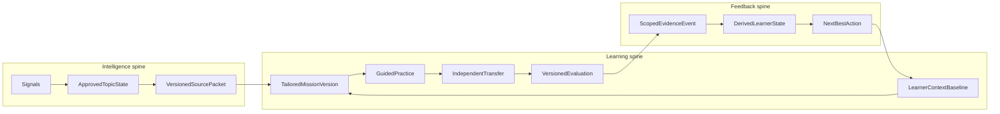

> **SUPERSEDED — October 2, 2026.** This document narrowed SkillGap to an "evidence-backed launch messaging" wedge. That direction is retired. The product is an AI-native learning environment for marketers that builds and adapts each person's learning path. See the Skillgap project's `claude/90-day-5k-mrr-mission.md`. Kept for history only.

# PRD: Evidence-Backed Launch Messaging

**Status:** In force under `CPO_DECISIONS_2026-08-28.md` — Track T (truth + solo) and allowlisted Track F (private foundation) are authorized now. Stage 2 still gates public claims, catalog cutover, and fluency/credential scale.  
**Version:** 1.1  
**Date:** 2026-08-28  
**Scope:** One end-to-end Product Marketing wedge at honest **8/10** — not platform-wide 8/10  
**Decision owner:** Product / founder  
**Predecessors:** `AI_LEARNING_SYSTEM_AUDIT_2026-08-27.md`, `PRD_Real_Work_Value_Loop.md`, `STRATEGY_Foundation.md`, `CPO_DECISIONS_2026-08-28.md`

---

## 1. Executive decision

SkillGap will close **one complete intelligence → tailored learning → real-work evidence → next-action loop** for a single professional wedge before expanding inventory, functions, rooms, or credential semantics.

**Target wedge:** A B2B SaaS Product Marketing Manager with a real launch deliverable entering review within seven days.

**Target outcome (45–60 minutes):** Turn confirmed product proof and dated market evidence into:

1. A structured **launch brief** with explicit assumptions and risks.
2. A **three-angle message matrix** with claim-to-proof traceability.
3. One **channel asset** derived from the matrix.
4. An **independent transfer response** for a different audience or channel.

**What 8/10 means here:** Every scored category in Section 3 reaches **≥8.0/10** on the audit rubric for this wedge. A critical failure in any category caps the grade below 8 regardless of average score. Platform-wide claims remain prohibited until separate audits pass.

**Hard gate (updated 2026-08-28):** Stage 2 still gates public value claims, catalog cutover, and fluency/credential scale. It does **not** freeze Track T (truthful copy, solo completion) or allowlisted Track F (private attempt/artifact/evaluation spine). See `CPO_DECISIONS_2026-08-28.md` D2. The Message Review lab (`app/(learn)/labs/message-review/`) remains validation infrastructure; its patterns are reused, not promoted as the product center.

---

## 2. Problem and opportunity

### 2.1 Audit baseline (2026-08-27)

| Dimension | Audit grade | User-visible gap |
|-----------|-------------|------------------|
| Vision quality | 8.5/10 | Strategy is strong |
| Reusable engineering foundation | 6.2/10 | Good subsystems exist |
| System integration | 3.4/10 | Subsystems do not operate as one loop |
| Deployed experience vs vision | 3.0/10 | Five single-Do missions, room-required, editorial queue |
| **Overall** | **3.6/10** | Promising parts, not the promised product |

The audit’s central instruction: **Do not add surfaces or mission inventory. Close one loop.**

### 2.2 What validation already proved

Slice 0–1 of `PRD_Real_Work_Value_Loop.md` established:

- The pressure-test wedge is **judgeable** (12 fixtures, deterministic checks, blinded comparison protocol).
- The lab implements the strongest AI patterns in the repo: strict schemas, fail-closed evaluation, revision diff, content-free telemetry.
- Lab completion does **not** authorize production infrastructure or proficiency claims.

### 2.3 What this PRD unlocks

If and only if Stage 2 passes, this PRD defines the **production foundation** in the order prescribed by `PRD_Real_Work_Value_Loop.md` Section 21:

1. Private artifact persistence and authoritative evaluation  
2. Reusable workspace, versions, and exports  
3. Durable workplace-outcome measurement  
4. Repeat-task workflow  
5. Skill evidence only after independent transfer  
6. Optional public sharing after explicit consent  
7. Social workflow only when density justifies it  

---

## 3. Audit-to-target scorecard

Each row maps an audit finding to a **requirement** and a **pass/fail 8/10 gate**. Implementation is not complete until every gate passes for the wedge.

| # | Audit category | Baseline | Target requirement | 8/10 gate (pass/fail) |
|---|----------------|----------|--------------------|------------------------|
| 1 | World intelligence & currentness | 2.0 | One fully traceable signal → approved topic → expiring source packet → mission version; no broad “market demand” until pipeline runs continuously | One trend traceable end-to-end in production DB; source packet has `expires_at`; stale packet blocks new starts; zero unsupported “why now” copy |
| 2 | Professional capability graph | 4.5 | `fp_capability_applications` links portable skills to PMM launch workflow with observable behavior and evidence rubric | One seeded application `pmm-b2b-saas-evidence-backed-launch-v1`; every mission activity maps to named capability + criterion |
| 3 | Learner model | 3.0 | Append-only evidence events; derived learner state; capture goal, baseline, scaffolding, time | Evidence events emitted only from cleared independent transfer; learner state reproducible from events; onboarding captures 30-day outcome |
| 4 | Curriculum & rich-media grounding | 4.0 | Native `LearningExperienceVersion`; rich MissionBriefV2 projection; 2+ approved source assets with objective links | Wedge preserves Watch/Do/Check/Reflect; ≥2 source segments each map to named objective; no lossy one-Do collapse for this wedge |
| 5 | Learning design & efficacy | 3.5 | Baseline → orient → guided practice → independent transfer → criterion feedback → 7-day use check | Median active time ≤60 min; doing ≥70% of session; transfer task required for completion |
| 6 | Assessment & evidence integrity | 3.8 | First-class attempts, artifacts, evaluations, criterion results; server-owned evaluation; abstention | Zero client-authoritative evaluation; zero blocking false clears on fixed eval set; ≥80% expert agreement |
| 7 | Recommendation & feedback loop | 2.5 | Persist recommendation decisions with reason features and outcomes; truthful reason codes | Next action references failed criterion or evidence gap; no `market_demand` label without live market state row |
| 8 | Rooms as delivery context | 4.0 | Solo canonical; same attempt in room optional | Full wedge completable without entering a room; room handoff preserves attempt ID |
| 9 | AI engineering & reliability | 5.0 | Shared gateway: versions, timeout, retry, hashes, cost, trace; continuous eval CI | 100% wedge AI calls through gateway; p95 eval ≤20s; median cost ≤$0.25/completion; CI eval suite on prompt change |
| 10 | Data architecture & operations | 4.0 | Reproducible migrations; generated types; RLS verified; signal dedupe enforced | Shadow DB rebuild succeeds; partial unique index on signals; zero cross-user artifact access |
| 11 | Product coherence & UX truth | 4.0 | Copy matches objects behind it | Zero instances of “capability proven,” “verified proficiency,” or “market-backed” without backing data |

**Grade rule:** If any row fails its gate, the wedge grade is **<8/10** regardless of other scores.

---

## 4. Product contract

### 4.1 Target user

**Primary:** Product Marketing Manager at a 50–500 person B2B SaaS company.

**Inclusion criteria:**

- Has a real launch or major update deliverable entering review within **7 days**.
- Uses ChatGPT, Claude, or similar weekly.
- Can supply organization-approved or sanitized product proof and market context.
- Has a named reviewer, approver, campaign, or publication destination.

**Exclusion (for pilot metrics):**

- No imminent deliverable.
- Cannot supply any approved proof.
- Sample/demo mode participants (preview only; no evidence or pilot counts).

### 4.2 Job to be done

> Turn fragmented product, customer, and competitive evidence into an aligned launch narrative and messages I can confidently use with stakeholders — and prove I can apply that workflow independently.

### 4.3 User promise (allowed copy)

**Primary:**

> Build an evidence-linked launch brief and message matrix from the proof and context you supply.

**Supporting:**

> In about an hour, practice a repeatable evidence-to-message workflow, get AI-reviewed feedback against disclosed criteria, and export work you can use in review.

**Required disclosure (always visible before content submission):**

> SkillGap sends your supplied text to OpenAI for extraction and review. SkillGap checks claims against the proof and context you confirm — not independent fact verification, stakeholder approval, or market performance.

### 4.4 Forbidden claims

Until separately validated and approved:

- Verified / proven product-marketing proficiency  
- Market-backed or trending recommendations without operational intelligence evidence  
- Current best practices without dated, approved sources  
- Evidence-backed when significant claims remain unlabeled assumptions  
- Better than ChatGPT (requires Stage 2 controlled comparison)  
- Platform-wide personalization or 8/10 platform grade  

Replace existing UI copy:

| Current (audit finding) | Replacement |
|-------------------------|-------------|
| Capability proven through completed work | Capability practiced |
| Market demand (fixed catalog) | Editorial next step *or* live market signal with inspectable row |
| Verified proficiency | AI-reviewed against supplied criteria |

### 4.5 Delivery mode

- **Solo is canonical.** The wedge runs in a dedicated solo mission player.
- **Rooms are optional (P1).** The same `fp_learning_attempts` row may attach a `room_id` without changing progress identity.
- **Sample mode:** Allowed for internal preview only. Produces no evidence events, receipts, or pilot metric credit.

---

## 5. User journey and learning design

Total target: **45–60 minutes** median active time; **p90 ≤75 minutes**.

### 5.1 Journey map

| Step | Duration | Activity | Pedagogy |
|------|----------|----------|----------|
| 0. Qualify | 2 min | Confirm real launch, deadline, role, intended deliverable | Gate low-intent traffic |
| 1. Capture context & evidence | 5–7 min | Launch type, objective, ICP, buyer/user, motion, channel, constraints; import/paste product + market evidence | Untrusted input; disclose model use |
| 2. Cold baseline | 5 min | Positioning statement + 3-message mini-matrix using normal workflow; no SkillGap templates | Pre-assessment |
| 3. Orient (Watch) | 6–8 min | 1–2 editorially approved segments: evidence → insight → claim → message | Retrieval check: fact vs inference vs assumption |
| 4. Guided launch brief (Do) | 10–12 min | Confirm evidence cards, resolve contradictions, complete brief fields | Progressive hints; Socratic questions before examples |
| 5. Scaffolded matrix (Do) | 10–12 min | Core promise, pillars, proof, objections, channel adaptations | Scaffolding adapts to baseline gaps |
| 6. Independent transfer (Do) | 8–10 min | Without hints/templates, produce one channel asset OR adapt matrix for second audience/channel | **Required transfer task** |
| 7. Evaluate & revise (Check) | 5–8 min | Criterion-level feedback; user accepts/rejects each proposed change | Never silent auto-apply |
| 8. Reflect & export | 3–5 min | Reflection prompt; export brief, matrix, claim ledger, channel asset | |
| 9. Day-7 follow-up | async | Report: incorporated, shared, rejected, revised, not used, no response | Workplace outcome |

### 5.2 Module structure (canonical experience)

Three modules aligned to Watch → Do → Check → Reflect:

**Module 1 — Baseline & orient**

- Activity: cold baseline artifact  
- Activity: retrieval check (3–5 items)  
- Watch: 1–2 source segments with objective tags  

**Module 2 — Guided construction**

- Activity: confirm work context (product proof ledger)  
- Activity: structured launch brief editor  
- Activity: scaffolded message matrix builder  

**Module 3 — Transfer & evidence**

- Activity: independent channel asset or audience adaptation (**unguided**)  
- Activity: criterion review + revision diff  
- Reflect: what changed from baseline; planned use in review  
- Export package  

### 5.3 Personalization inputs

Minimum inputs that must affect the experience:

| Input | Source | Must influence |
|-------|--------|----------------|
| Launch type (new feature, tier, reposition) | User + context confirm | Brief template emphasis, risk prompts |
| Company stage / sales motion | Profile + context | Proof requirements, channel suggestions |
| Target audience & channel | Context confirm | Matrix rows, transfer task variant |
| Evidence availability | Proof ledger | Scaffolding depth; blocks “evidence-backed” if insufficient |
| Deadline | User | Pacing copy; omits deep optional sections when tight |
| AI experience (fluency) | Profile | Hint density, example provision |
| Baseline performance | Baseline artifact eval | Extra guidance on weak criteria only |

**Acceptance:** Two materially different learner profiles receive differences in ≥3 of: scaffolding level, examples shown, question sequence, evidence requirements, transfer task variant, success criteria emphasis.

**Blind test:** PMM experts prefer tailored version over generic version ≥65% on held-out cases.

### 5.4 Anti-demo requirements (release blockers)

These distinguish a real learning system from a polished demo:

1. Real project inputs persisted as immutable context snapshot  
2. Evidence insufficiency visibly blocks “evidence-backed” label  
3. Source-level provenance on every material claim  
4. Cold baseline before assistance  
5. Independent transfer without hints  
6. Versioned persistence with save/resume across reload  
7. Server-owned evaluation with abstention  
8. Export + 7-day actual-use measurement  
9. Privacy-safe telemetry (content-free)  
10. Sample mode excluded from credentials and pilot metrics  

---

## 6. Output and evidence contracts

### 6.1 Launch brief (required fields)

| Field | Type | Validation |
|-------|------|------------|
| `launchObjective` | string | 20–500 chars |
| `productChange` | string | What shipped or will ship |
| `icp` | string | Specific segment, not “businesses” |
| `buyerVsUser` | string | Distinct when applicable |
| `problemStatement` | string | Urgent job/problem |
| `positioningThesis` | string | One-sentence strategic claim |
| `alternatives` | string[] | Current choices including status quo |
| `differentiation` | string | Against named alternative |
| `proofLedger` | ProofEntry[] | See 6.3 |
| `assumptions` | string[] | Explicit unknowns |
| `risks` | string[] | Messaging or launch risks |
| `successMeasures` | string[] | How launch success is judged |
| `channels` | ChannelEnum[] | Planned destinations |
| `stakeholders` | string[] | Review/approval chain |
| `deadline` | ISO date | From user context |

### 6.2 Message matrix schema

Three rows minimum. Each row:

| Field | Required |
|-------|----------|
| `audienceAndJob` | yes |
| `desiredAction` | yes |
| `currentAlternative` | yes |
| `messageAngle` | yes |
| `valueClaim` | yes |
| `proofRefs` | yes — proof IDs or `hypothesis:` prefix |
| `objection` | yes |
| `objectionResponse` | yes |
| `channelExpression` | yes |

Reuse and extend `lib/labs/messageReview/types.ts` shapes (`MessageMatrixRow`, `MessageReviewProof`).

### 6.3 Proof ledger

Each proof entry:

```typescript
interface ProofEntry {
  proofId: string;           // stable within attempt, e.g. "P1"
  text: string;              // 10–500 chars
  status: "approved_fact" | "hypothesis";
  sourceType: "product_doc" | "customer_quote" | "analytics" | "competitive" | "market_source";
  sourceRef?: string;        // packet claim ID or user citation
  observedAt?: string;       // ISO date when known
}
```

**Namespaces (never collapse):**

- `market:<packetId>:<claimId>` — from approved source packet  
- `product:<contextVersionId>:<proofId>` — user-confirmed product proof  
- `hypothesis:<contextVersionId>:<proofId>` — explicitly labeled inference  

### 6.4 Claim ledger (export artifact)

For every material factual claim in brief, matrix, or channel asset:

- `claimText` — exact span  
- `artifactLocation` — JSON path  
- `evidenceRefs` — resolved IDs or `assumption`  
- `confidence` — `grounded` | `hypothesis` | `unsupported`  

Unsupported material claims **block** clearance status.

### 6.5 Channel asset

One concrete output for selected channel enum:

- `landing_hero`, `marketing_email`, `paid_social`, `organic_social`, `sales_enablement`, `stakeholder_summary`

Minimum: headline/value prop + supporting copy appropriate to channel.

### 6.6 Evaluation criterion IDs

Behaviorally anchored rubric (1–4 scale for analytics; pass/fail/abstain for gates):

| ID | Label | Blocking |
|----|-------|----------|
| `evidence_discipline` | Claims map to proof or visible hypothesis | yes |
| `audience_specificity` | ICP and job are concrete | yes |
| `strategic_coherence` | Brief and matrix align on positioning | yes |
| `differentiation` | Distinct case vs named alternative | yes |
| `claim_proof_integrity` | No unsupported factual claims | yes |
| `message_hierarchy` | Clear promise → pillars → proof | no |
| `channel_transfer` | Independent asset fits channel constraints | yes (transfer task) |
| `objection_quality` | Plausible objection + direct response | no |

### 6.7 Evaluation states

No numeric quality score in user-facing UI.

| State | Meaning |
|-------|---------|
| `blocking_issues_remain` | Cannot mark reviewed-clear |
| `material_revisions_recommended` | Usable with changes |
| `cleared_against_supplied_context` | All blocking criteria pass |
| `review_unavailable` | Model/validator failure — no evidence emitted |

Always show footer:

> Checked against the context and proof you supplied. Factual accuracy, authorship, stakeholder approval, and market performance were not independently verified.

### 6.8 Versioning rules

- Context edits → new `fp_work_context_versions` row (confirmed versions immutable).  
- Artifact edits → new `fp_artifact_versions` row with `parent_version_id`.  
- AI-proposed revisions → user accept creates child version; reject creates nothing.  
- Evaluations bind to exact `artifact_version_id` + content hash.  
- Re-evaluation required after any artifact version change.  

---

## 7. Closed-loop architecture

### 7.1 Canonical ownership

| Concept | Canonical store | Compatibility projection |
|---------|-----------------|--------------------------|
| Experience definition | `MissionBriefV2` + `fp_capability_applications` | `fp_learning_paths` |
| Runtime session | `fp_learning_attempts` | `fp_learning_progress.active_attempt_id` |
| Learner work | `fp_artifacts` / `fp_artifact_versions` | none (new) |
| Assessment | `fp_evaluations` / `fp_evaluation_criteria` | not client JSON |
| Skill update | `fp_skill_evidence_events` | `fp_user_skills` (derived) |
| Next action | `fp_recommendation_decisions` | Missions/Home UI |

### 7.2 System flow



### 7.3 Reuse vs quarantine

**Reuse:**

- `MissionBriefV2`, source packets, editorial lifecycle (`lib/missions/`)
- Watch/Do/Check/Reflect renderers (`components/learn/`)
- Message Review deterministic checks, schemas, reviewer pattern (`lib/labs/messageReview/`)
- Auth, Supabase clients, `SAFETY_PROMPT` (`lib/breaks/contentSafety.ts`)
- Atomic completion patterns (`app/api/learn/paths/[id]/route.ts`) — adapted, not copied blindly

**Adapt:**

- `legacyPathProjector.ts` — add **rich projection** for wedge briefs; retain one-Do projection for legacy
- `pathCompletion.ts`, `receiptCalculator.ts` — wedge bypasses path-count fluency; emits scoped evidence only
- `missionCatalogRecommendations.ts` — truthful reason codes for wedge next actions

**Quarantine from wedge:**

- `curriculumGenerator.ts` on-demand path invention for this wedge  
- Lab routes as product surface (`/labs/message-review` stays study/isolated)  
- Room-only mission execution  
- Fixed `market_demand` labels with empty `fp_skill_market_state`  
- Public proficiency claims from single completion  

### 7.4 MissionBriefV2 extensions (additive, optional fields)

Extend brief schema without breaking existing rows:

```typescript
interface MissionBriefV2WedgeExtensions {
  applicationRef?: {
    stableKey: string;      // "pmm-b2b-saas-evidence-backed-launch"
    version: number;
  };
  activityPlan?: Array<{
    activityId: string;
    kind: "baseline" | "watch" | "do" | "check" | "reflect" | "transfer";
    moduleIndex: number;
    objectiveIds: string[];
    scaffoldingLevel: "none" | "light" | "full";
  }>;
  artifactContracts?: {
    launchBriefSchemaVersion: string;
    matrixSchemaVersion: string;
    channelAssetSchemaVersion: string;
  };
  runtime?: {
    workspaceKind: "pmm_launch_workspace";
    soloCanonical: true;
  };
  evidencePolicyVersion?: string;
}
```

---

## 8. Narrow currentness spine

Do **not** wait for full intelligence engine recovery to ship the wedge. Do **not** claim broad currentness until the engine runs continuously.

### 8.1 Wedge scope

One editorially approved **source packet** for topic slug aligned to B2B SaaS launch messaging (e.g. `launch-positioning` or approved canonical topic).

Packet requirements:

- `sourcePacketId`, `sourcePacketHash`, `expiresAt` on `MissionBriefV2.topic`  
- 2–4 assets: ≥1 authoritative (official/docs) + ≥1 independent (creator/article)  
- Each asset maps to packet inputs via `fp_source_packet_inputs`  
- Human approval recorded in existing editorial tables  

### 8.2 Traceability (P0 for this wedge)

For the wedge’s `whyThisMattersNow` copy, store inspectable references:

- `sourceReferences[]` on MissionBriefV2 (already exists)  
- UI “Why this now” links to source excerpt + `observedAt`  
- If packet expired → block new attempt starts; show refresh message  

### 8.3 Intelligence pipeline (P1, parallel)

Restore full loop per audit Phase 1 — **not a blocker for wedge P0** if editorial packet is fresh and dated:

1. Deduplicate `fp_signals`; add partial unique index on `(source, source_id)`  
2. Process one controlled batch  
3. Produce one `fp_trend_states` row with evidence window  
4. Alert when collection stale >7 days  

**Gate to use `market_demand` reason code:** `fp_skill_market_state` row exists for relevant skill with `computed_at` within freshness SLO.

---

## 9. AI and trust contract

### 9.1 Gateway (new: `lib/ai/gateway.ts`)

All wedge consequential calls route through one registry (`lib/ai/operationRegistry.ts`).

| Operation | Model | Timeout | Max retry |
|-----------|-------|---------|-----------|
| `context_extract` | gpt-4o-mini | 20s | 1 (transport/429/5xx only) |
| `launch_brief_review` | gpt-4o-mini | 20s | 1 |
| `matrix_review` | gpt-4o-mini | 20s | 1 |
| `transfer_review` | gpt-4o-mini | 20s | 1 |
| `revision_propose` | gpt-4o-mini | 20s | 1 |

Every call:

- `response_format: { type: 'json_schema' }` strict  
- Zod validation after parse  
- `SAFETY_PROMPT` included  
- Records row in `fp_llm_runs`: operation, prompt_version, schema_version, input_hash, output_hash, latency_ms, tokens, estimated_cost_usd, status, trace_id  
- **Never** logs raw user content  

### 9.2 Evaluation pipeline

Port Message Review pattern:

1. Strict artifact schema validation  
2. Deterministic proof-reference resolution  
3. Deterministic checks (`deterministicChecks.ts` patterns): unsupported metrics, missing proof, duplicate angles, audience mismatch, channel constraints, prompt-injection isolation  
4. Specialist model review (structured)  
5. Deterministic reconciliation — model cannot override deterministic blockers  
6. Re-run deterministics on proposed revision  
7. Present diff; user explicit accept  

### 9.3 Fail-closed rules

| Failure | Behavior |
|---------|----------|
| Timeout | `review_unavailable`; preserve artifact; no evidence |
| Malformed JSON | Same |
| Provider error | Same |
| Abstain on blocking criterion | Cannot clear; user may continue editing |
| Deterministic blocker | Cannot clear regardless of model opinion |

### 9.4 Eval fixtures and CI

Extend lab’s 12 fixtures with launch-brief cases:

- Stale market evidence  
- Mixed product/market claim namespaces  
- Unresolved dependency between brief and matrix  
- Omitted risk  
- Invented competitive claim  
- Source replacement mid-session  

**CI gate on prompt/rubric/model change:**

- 0 critical false clears  
- 100% blocking-case recall on safety set  
- ≥80% criterion agreement vs expert labels  
- Macro-F1 ≥0.80 on judgment criteria  
- Clean-control false-block ≤10%  

### 9.5 Cost controls

- Database-backed rate limits per user per operation (not in-memory)  
- Cache evaluation by `(artifact_version_id, evaluator_version, content_hash)`  
- Batch cap: 1 artifact evaluated per request  
- Alert if median cost >$0.25 or p95 >$0.50 per completion  

---

## 10. Data model and API specification

### 10.1 Preconditions

Before applying wedge migration:

1. Reconcile 39 local vs 8 deployed migration ledger entries  
2. Generate Supabase TypeScript types  
3. Deduplicate `fp_signals`; add partial unique index  
4. Document baseline schema snapshot  

### 10.2 New tables (P0)

#### `fp_capability_applications`

```sql
CREATE TABLE fp_capability_applications (
  id UUID PRIMARY KEY DEFAULT gen_random_uuid(),
  stable_key TEXT NOT NULL,
  version INTEGER NOT NULL,
  professional_function TEXT NOT NULL,
  role_archetype TEXT NOT NULL,
  workflow TEXT NOT NULL,
  target_behavior TEXT NOT NULL,
  evidence_rubric JSONB NOT NULL,
  status TEXT NOT NULL DEFAULT 'draft',
  created_at TIMESTAMPTZ NOT NULL DEFAULT now(),
  updated_at TIMESTAMPTZ NOT NULL DEFAULT now(),
  UNIQUE (stable_key, version)
);
```

Seed: `pmm-b2b-saas-evidence-backed-launch-v1`.

#### `fp_capability_application_skills`

```sql
CREATE TABLE fp_capability_application_skills (
  application_id UUID NOT NULL REFERENCES fp_capability_applications(id),
  skill_id UUID NOT NULL REFERENCES fp_skills(id),
  relevance TEXT NOT NULL,
  PRIMARY KEY (application_id, skill_id)
);
```

#### `fp_learning_attempts`

```sql
CREATE TABLE fp_learning_attempts (
  id UUID PRIMARY KEY DEFAULT gen_random_uuid(),
  user_id UUID NOT NULL REFERENCES auth.users(id),
  application_id UUID NOT NULL REFERENCES fp_capability_applications(id),
  mission_brief_id UUID,
  learning_path_id UUID REFERENCES fp_learning_paths(id),
  mission_brief_version INTEGER NOT NULL,
  application_version INTEGER NOT NULL,
  source_packet_id UUID NOT NULL,
  source_packet_hash TEXT NOT NULL,
  delivery_context TEXT NOT NULL DEFAULT 'solo',
  room_id UUID REFERENCES fp_parties(id),
  state TEXT NOT NULL DEFAULT 'in_progress',
  current_activity_id TEXT,
  idempotency_key TEXT,
  started_at TIMESTAMPTZ NOT NULL DEFAULT now(),
  last_activity_at TIMESTAMPTZ NOT NULL DEFAULT now(),
  completed_at TIMESTAMPTZ,
  UNIQUE (user_id, idempotency_key)
);
CREATE INDEX idx_learning_attempts_user_state ON fp_learning_attempts (user_id, state, last_activity_at DESC);
```

#### `fp_work_context_versions`

```sql
CREATE TABLE fp_work_context_versions (
  id UUID PRIMARY KEY DEFAULT gen_random_uuid(),
  user_id UUID NOT NULL REFERENCES auth.users(id),
  attempt_id UUID NOT NULL REFERENCES fp_learning_attempts(id),
  version INTEGER NOT NULL,
  schema_version TEXT NOT NULL,
  context JSONB NOT NULL,
  content_hash TEXT NOT NULL,
  status TEXT NOT NULL DEFAULT 'draft',
  supersedes_id UUID REFERENCES fp_work_context_versions(id),
  llm_run_id UUID,
  created_at TIMESTAMPTZ NOT NULL DEFAULT now(),
  UNIQUE (attempt_id, version),
  UNIQUE (attempt_id, content_hash)
);
```

#### `fp_artifacts` / `fp_artifact_versions`

```sql
CREATE TABLE fp_artifacts (
  id UUID PRIMARY KEY DEFAULT gen_random_uuid(),
  user_id UUID NOT NULL REFERENCES auth.users(id),
  attempt_id UUID NOT NULL REFERENCES fp_learning_attempts(id),
  artifact_type TEXT NOT NULL,
  status TEXT NOT NULL DEFAULT 'draft',
  current_version_id UUID,
  created_at TIMESTAMPTZ NOT NULL DEFAULT now(),
  updated_at TIMESTAMPTZ NOT NULL DEFAULT now(),
  UNIQUE (attempt_id, artifact_type)
);

CREATE TABLE fp_artifact_versions (
  id UUID PRIMARY KEY DEFAULT gen_random_uuid(),
  user_id UUID NOT NULL REFERENCES auth.users(id),
  artifact_id UUID NOT NULL REFERENCES fp_artifacts(id),
  version INTEGER NOT NULL,
  parent_version_id UUID REFERENCES fp_artifact_versions(id),
  context_version_id UUID NOT NULL REFERENCES fp_work_context_versions(id),
  source_packet_id UUID NOT NULL,
  source_packet_hash TEXT NOT NULL,
  schema_version TEXT NOT NULL,
  content JSONB NOT NULL,
  content_hash TEXT NOT NULL,
  created_by TEXT NOT NULL,
  llm_run_id UUID,
  created_at TIMESTAMPTZ NOT NULL DEFAULT now(),
  UNIQUE (artifact_id, version)
);
```

`artifact_type` enum: `baseline`, `launch_brief`, `message_matrix`, `channel_asset`, `transfer_response`.

#### `fp_evaluations` / `fp_evaluation_criteria`

```sql
CREATE TABLE fp_evaluations (
  id UUID PRIMARY KEY DEFAULT gen_random_uuid(),
  user_id UUID NOT NULL REFERENCES auth.users(id),
  attempt_id UUID NOT NULL REFERENCES fp_learning_attempts(id),
  artifact_version_id UUID NOT NULL REFERENCES fp_artifact_versions(id),
  evaluator_key TEXT NOT NULL,
  evaluator_version TEXT NOT NULL,
  prompt_version TEXT NOT NULL,
  rubric_version TEXT NOT NULL,
  llm_run_id UUID,
  status TEXT NOT NULL,
  result JSONB NOT NULL,
  confidence NUMERIC,
  created_at TIMESTAMPTZ NOT NULL DEFAULT now(),
  UNIQUE (artifact_version_id, evaluator_key, evaluator_version, rubric_version)
);

CREATE TABLE fp_evaluation_criteria (
  evaluation_id UUID NOT NULL REFERENCES fp_evaluations(id),
  criterion_key TEXT NOT NULL,
  outcome TEXT NOT NULL,
  confidence NUMERIC,
  rationale TEXT,
  evidence_refs JSONB,
  PRIMARY KEY (evaluation_id, criterion_key)
);
```

#### `fp_llm_runs`

```sql
CREATE TABLE fp_llm_runs (
  id UUID PRIMARY KEY DEFAULT gen_random_uuid(),
  user_id UUID,
  operation TEXT NOT NULL,
  call_site TEXT NOT NULL,
  model TEXT NOT NULL,
  prompt_version TEXT NOT NULL,
  schema_version TEXT,
  input_hash TEXT NOT NULL,
  output_hash TEXT,
  status TEXT NOT NULL,
  latency_ms INTEGER,
  input_tokens INTEGER,
  output_tokens INTEGER,
  estimated_cost_usd NUMERIC,
  provider_request_id TEXT,
  trace_id TEXT,
  created_at TIMESTAMPTZ NOT NULL DEFAULT now()
);
```

### 10.3 P1 tables

- `fp_skill_evidence_events` — append-only; links skill, application, attempt, artifact_version, evaluation, scaffolding, scope  
- `fp_work_outcomes` — day-7 follow-up  
- `fp_recommendation_decisions` — next-action attribution  
- `fp_source_packet_inputs` — materialize packet lineage  

### 10.4 RLS policy pattern

All new tables: RLS enabled; policy `user_id = auth.uid()` for SELECT/INSERT/UPDATE. Service-role routes **re-verify** `user_id` on every mutation. No public-read policies on artifact tables. Do not embed private artifact IDs in public `fp_achievements`.

### 10.5 API routes (P0)

| Route | Method | Responsibility |
|-------|--------|----------------|
| `/api/learn/attempts` | POST | Start/resume wedge attempt; idempotent |
| `/api/learn/attempts/[id]` | GET | Owner-safe state bundle |
| `/api/learn/attempts/[id]` | PATCH | Position/state transitions only |
| `/api/learn/attempts/[id]/context/extract` | POST | AI draft context (unconfirmed) |
| `/api/learn/attempts/[id]/context/confirm` | POST | Immutable confirmed context version |
| `/api/learn/attempts/[id]/artifacts` | POST | Create artifact identity |
| `/api/learn/artifacts/[id]/versions` | POST | New version; optimistic concurrency via `parent_version_id` + hash |
| `/api/learn/artifacts/[id]/evaluate` | POST | Server evaluation; accepts `artifactVersionId` only |
| `/api/learn/evaluations/[id]/apply` | POST | Apply accepted revisions → child version |
| `/api/learn/artifacts/[id]/export` | GET | Markdown/CSV; spreadsheet injection protection |
| `/api/learn/attempts/[id]/complete` | POST | Transactional gate check |
| `/api/learn/attempts/[id]/outcome` | POST | Day-7 workplace result |

**Legacy compatibility:** `/api/learn/paths/[id]` unchanged for non-wedge paths; wedge allowlist delegates completion to attempt service.

### 10.6 Completion gate (server-side)

`POST .../complete` succeeds only if:

1. Confirmed context version exists  
2. Required artifacts exist: `baseline`, `launch_brief`, `message_matrix`, `channel_asset`, `transfer_response`  
3. Latest version of each required artifact has evaluation with all **blocking** criteria ≠ `fail`  
4. `transfer_response` evaluation used `scaffoldingLevel: none` activity  
5. Source packet not expired at attempt start (stored on attempt)  
6. Idempotent — second call returns same completion record  

Client-supplied evaluation JSON is **ignored**.

### 10.7 Lineage rules (non-negotiable)

1. Every artifact version references exact mission brief, application, source packet, and context versions.  
2. Evidence namespaces never collapse (Section 6.3).  
3. Models cannot promote hypothesis → approved_fact without user confirm.  
4. Evaluations bind to one immutable content hash.  
5. Historical artifacts never rewritten when source expires.  
6. Workplace use is user-reported unless separately verified.  
7. LLMs cannot create canonical topics, publish missions, or advance fluency directly.  

### 10.8 Rollback

- Feature flag: `launch_evidence_wedge_v1` (allowlist)  
- Rollback = disable flag; stop new starts; existing attempts remain readable/exportable  
- Migrations additive only; no destructive down-migrate of user evidence  
- Retain pilot artifacts 30 days; support participant deletion on request  

---

## 11. Truthful learner state

### 11.1 Separate concepts

| Concept | Definition | User-facing label |
|---------|------------|-------------------|
| Experience completed | All required activities done | “Experience complete” |
| Artifact evaluated | Server evaluation returned | “AI-reviewed” |
| Evidence accepted | Blocking criteria cleared on transfer | “Practice recorded” (private) |
| Workplace use | Day-7 outcome reported | “Used in work” (self-reported) |
| Proficiency | Multiple evidence events + calibration | **Not claimed in P0** |

### 11.2 Evidence emission (P1)

Emit `fp_skill_evidence_events` only when:

- Artifact type = `transfer_response`  
- Evaluation status = `cleared_against_supplied_context`  
- Activity scaffolding = `none`  
- Evaluator calibration version pinned  

Scope label: `guided_practice` vs `independent_transfer` vs `workplace_use` — never conflate.

### 11.3 Receipts and achievements

- P0: **No** public receipt or fluency advancement from wedge completion  
- P1: Opt-in private scoped receipt with evidence limitations stated  
- Legacy receipts remain; labeled `legacy_unverified` if backfill attempted  
- Never backfill fabricated lineage  

### 11.4 Next best action

After completion, persist `fp_recommendation_decisions` with:

- `reason_codes`: e.g. `weak_differentiation`, `insufficient_proof`, `channel_transfer_gap`  
- `feature_snapshot`: failed criterion keys, evidence gaps  
- **Not** `market_demand` unless market state row exists  

UI shows one concrete next action: “Practice objection handling with stronger proof” — not “Trending now.”

---

## 12. Validation and release gates

### 12.1 Prerequisite: Stage 2 validation (claims and scale)

From `PRD_Real_Work_Value_Loop.md` — **all** must pass before public “better than ChatGPT” claims, catalog cutover, or fluency/credential scale. Track T and allowlisted Track F may proceed under `CPO_DECISIONS_2026-08-28.md`:

- ≥21/30 SkillGap preferred over strongest canonical-prompt baseline  
- ≥15/30 judge-confirmed material issues caught vs baseline  
- ≥90% blocking flags upheld by judge consensus  
- ≥24/30 complete without operator rescue  
- Median added active time ≤10 minutes (validation lab metric)  
- ≥15/30 incorporated/used within 7 days  
- ≥9/30 voluntary second review within 30 days  
- Zero privacy/trust breaches  

### 12.2 Production technical gates (pre-pilot)

| Gate | Criteria |
|------|----------|
| Schema | Shadow DB rebuild; types generated; RLS tests pass |
| Security | Zero cross-user access; zero content in logs/analytics |
| Eval CI | Section 9.4 thresholds on pinned fixture set |
| Browser | Section 13.2 journeys pass desktop + mobile |
| SLO | Section 14 thresholds for 48h internal canary |

### 12.3 Production pilot (12–20 users)

Recruit 16–20; require ≥12 valid completions.

| Metric | Threshold |
|--------|-----------|
| Completion rate (eligible enrolled) | ≥70% |
| Independent transfer improvement | ≥65% improve ≥1 rubric level on ≥2 blocking dimensions |
| Blind expert preference vs same-input baseline | ≥65% |
| Confirmed 7-day use | ≥60% (`incorporated`, `approved`, `sent_for_review`, `changed_decision`) |
| Evaluator agreement | ≥80%; macro-F1 ≥0.80; 0 critical false passes |
| Median active time | ≤60 min; p90 ≤75 min |
| Privacy comprehension | ≥90% correctly state verification limits |
| Save/resume | ≥99.5% success in test matrix |

Report: raw numerators, denominators, exclusions, disagreements. Non-response counts as not used.

### 12.4 Internal 8/10 assignment

Assign wedge grade **8/10** only when:

- Section 3 scorecard: every row passes  
- Section 12.1: Stage 2 passed  
- Section 12.2: technical gates passed  
- Section 12.3: pilot thresholds passed  

Until then: internal label **“in development”** or **“limited pilot.”**

---

## 13. Testing plan

### 13.1 Automated layers

| Layer | Scope | Target |
|-------|-------|--------|
| Unit | Schemas, deterministic checks, lineage, diff, export | +40 tests |
| Integration | Attempt lifecycle, RLS, idempotency, completion gate | +25 tests |
| Contract | MissionBriefV2 rich projection, API shapes | +15 tests |
| Offline eval | Fixture suite vs expert labels | CI blocking |
| Migration | Replay on shadow DB | 1 suite |

Add scripts to `package.json`:

```json
{
  "test:unit": "vitest run",
  "test:integration": "vitest run --config vitest.integration.config.ts",
  "test:eval": "vitest run lib/learn/pmmLaunch/eval.fixtures.test.ts",
  "typecheck": "tsc --noEmit"
}
```

### 13.2 Browser journeys (Playwright)

Automate in Chromium desktop + WebKit mobile (390px):

1. Unauthorized / non-allowlisted user rejected  
2. Disclosure before first content submission  
3. Full journey: baseline → brief → matrix → review → transfer → export  
4. Reload at each step resumes same attempt  
5. Two-tab edit shows version conflict, not silent overwrite  
6. Evaluator timeout → `review_unavailable`, artifact preserved  
7. User B cannot access User A attempt (404, no leak)  
8. No user content in URL, console, or network analytics payloads  
9. Keyboard-only completion; no blocked controls on mobile  

### 13.3 Manual pilot protocol

- Facilitator observes without coaching past normal UI  
- Record operator rescue separately (excluded from completion numerator)  
- Day-7 follow-up to all participants including non-responders  
- Blinded expert review subset (minimum 8 pairs)  

---

## 14. Observability and SLOs

### 14.1 Pilot SLOs

| Metric | Target |
|--------|--------|
| Save success | ≥99.5% |
| p95 save latency | <1.5s |
| Resume success | ≥99.5% |
| p95 experience load | <2.5s |
| Eval valid result or explicit unavailable within 20s | ≥95% |
| Evaluator unavailable rate | ≤5% |
| AI trace coverage | 100% |
| Duplicate attempts/evaluations | 0 |
| Starts against expired packets | 0 |
| Median AI cost/completion | ≤$0.25 |
| p95 AI cost/completion | ≤$0.50 |
| Content-bearing log/analytics events | 0 |

### 14.2 Immediate rollback triggers

- Any cross-user data access  
- Any private content in logs/analytics  
- Any critical false clearance on blocking criterion  
- Save failure rate >0.5% over 1h  
- Evaluator unavailability >10% over 20+ calls  

### 14.3 Content-free analytics events

Extend lab pattern:

- `wedge_attempt_started`  
- `context_confirmed`  
- `baseline_submitted`  
- `transfer_submitted`  
- `evaluation_completed`  
- `artifact_exported`  
- `attempt_completed`  
- `outcome_reported`  

Allowed properties: experiment/wedge version, duration buckets, criterion pass counts, export type, operator_rescue boolean. **Forbidden:** any user text, proof, company names, campaign names.

---

## 15. Execution epic

Dependency-ordered slices. Each slice: 1–3 days. Do not start a slice until its dependencies exit.

### Phase A — Truth and preflight (3 days)

**A.1 Product contract lock (1d)**  
Finalize copy, forbidden claims, cohort criteria. Update UI strings per Section 4.4.

**A.2 Release baseline (1d)**  
Fix `legacyPathProjector.idempotency.test.ts` mock. Add test scripts. Establish changed-file lint gate.

**A.3 Schema preflight (1d)**  
Reconcile migration ledger. Generate types. Classify security advisor findings. Record Stage 2 pass + PRD exception decision.

*Exit:* 54/54 targeted tests pass; typecheck passes; migration plan approved.

### Phase B — Canonical contracts (4 days)

**B.1 Schemas and rubric (2d)**  
`lib/learn/pmmLaunch/schemas.ts` — brief, matrix, proof, channel, evaluation.

**B.2 Approved curriculum v1 (2d)**  
One static MissionBriefV2 + source packet + activity plan. Editor signs expiry.

*Exit:* Every Watch asset maps to objective; every criterion observable.

### Phase C — Evidence spine (6 days)

**C.1 Migration (3d)**  
Tables Section 10.2; signal dedupe index; RLS policies.

**C.2 Services + routes (3d)**  
`attemptService.ts`, artifact versioning, completion gate, gateway stub.

*Exit:* Fresh DB migration; RLS tests; idempotent attempt create.

### Phase D — Narrow intelligence trace (3 days)

**D.1 Source packet inputs (1d)**  
`fp_source_packet_inputs`; packet assembler linkage.

**D.2 Why-now UI (1d)**  
Inspectable source references on mission intro.

**D.3 Freshness gate (1d)**  
Block starts on expired packet.

*Exit:* One end-to-end packet trace documented in DB.

### Phase E — Solo experience (8 days)

**E.1 Solo runner (3d)**  
`SoloMissionPlayer.tsx`; route `app/(learn)/missions/[id]/solo/page.tsx`; uses `ContentViewer`.

**E.2 PMM workspace (3d)**  
`PmmLaunchWorkspace.tsx`; adapt lab components.

**E.3 Review + export (2d)**  
Pressure test, revision diff, Markdown/CSV export.

*Exit:* Full journey solo; reload preserves attempt.

### Phase F — Authoritative evaluation (7 days)

**F.1 AI gateway (2d)**  
`lib/ai/gateway.ts`, `operationRegistry.ts`, `fp_llm_runs`.

**F.2 Evaluator (3d)**  
Port lab reviewer; launch-brief fixtures.

**F.3 Completion semantics (2d)**  
Separate completed/evaluated/evidence; next action.

*Exit:* Client cannot author evaluation; 0 false clears on blocking set.

### Phase G — Learner update (4 days, P1)

**G.1 Evidence events (2d)**  
Append-only emission on cleared transfer.

**G.2 Recommendations (2d)**  
`fp_recommendation_decisions`; truthful next action UI.

*Exit:* State reproducible from events; no fake market demand.

### Phase H — Release hardening (6 days)

**H.1 Automated coverage (2d)**  
Integration + eval CI.

**H.2 Browser suite (2d)**  
Section 13.2 journeys.

**H.3 Canary + security (2d)**  
2 internal accounts; advisor re-check.

*Exit:* 3 consecutive green CI runs; canary SLOs met.

### Phase I — Pilot and limited release (2 weeks)

**I.1 Recruit and run (10d)**  
16–20 PMMs; Stage 12.3 protocol.

**I.2 Analyze and decide (4d)**  
Report; assign 8/10 or revise/stop.

*Exit:* Section 12.4 criteria met OR documented stop/revise decision.

### Dependency graph

```
A ──> B ──> C ──> E ──> F ──> H ──> I
         └─> D ────────┘
C ──> G (P1, parallel after F.3)
```

**Stage 2 validation (external to epic):** Must complete before public claims, catalog cutover, or Phase I limited release. It does not block Phase A–C private foundation work.

---

## 16. File reference

| File | Change |
|------|--------|
| `PRD_Evidence_Backed_Launch_Messaging.md` | This document |
| `lib/missions/types/missionBriefV2.ts` | Add optional wedge extension fields |
| `lib/missions/schema/missionBriefSchema.ts` | Validate extensions |
| `lib/missions/services/legacyPathProjector.ts` | Rich projection for wedge; legacy one-Do retained |
| `lib/missions/services/sourcePacketAssembler.ts` | Packet input materialization |
| `lib/learn/pmmLaunch/schemas.ts` | **New** — artifact contracts |
| `lib/learn/pmmLaunch/projector.ts` | **New** — experience projection |
| `lib/learn/pmmLaunch/attemptService.ts` | **New** — attempt lifecycle |
| `lib/learn/pmmLaunch/evaluator.ts` | **New** — production evaluator |
| `lib/learn/pmmLaunch/lineage.ts` | **New** — provenance helpers |
| `lib/ai/gateway.ts` | **New** — structured operation gateway |
| `lib/ai/operationRegistry.ts` | **New** — operation definitions |
| `components/learn/SoloMissionPlayer.tsx` | **New** — solo runner |
| `components/learn/PmmLaunchWorkspace.tsx` | **New** — structured editors |
| `components/missions/MissionDetailPage.tsx` | Add “Start solo” primary action for wedge |
| `app/(learn)/missions/[id]/solo/page.tsx` | **New** — solo route |
| `app/api/learn/attempts/route.ts` | **New** |
| `app/api/learn/attempts/[id]/*` | **New** |
| `app/api/learn/artifacts/[id]/*` | **New** |
| `lib/labs/messageReview/deterministicChecks.ts` | Extract shared checks to `lib/learn/pmmLaunch/deterministicChecks.ts` |
| `lib/labs/messageReview/reviewer.ts` | Reference patterns; lab stays isolated |
| `lib/learn/pathCompletion.ts` | Wedge delegates to attempt completion |
| `lib/skills/receiptCalculator.ts` | Exclude wedge from path-count fluency |
| `lib/missionCatalogRecommendations.ts` | Truthful reason codes |
| `supabase/migrations/20260828_pmm_launch_wedge_spine.sql` | **New** — P0 tables |

---

## 17. Explicit non-goals

- Other marketing specialties (content, demand gen, lifecycle) in P0  
- Broad path catalog or on-demand topic generation for this wedge  
- Authority indexes, public benchmarks, portable verified skill graphs  
- Room-required mission execution  
- Synthetic users, team workspaces, social growth loops  
- Learned recommenders or knowledge tracing  
- Automatic market research, legal approval, or publishing integrations  
- Direct Google Docs / Notion / CRM integrations in P0  
- Replacing PMM judgment or stakeholder alignment  
- Platform-wide 8/10 claims  
- Production investment before Stage 2 validation passes  

---

## 18. Acceptance criteria (summary)

1. Stage 2 validation gates passed before public claims or limited release (Section 12.1). Track T/F may ship privately before that.  
2. Unauthorized users cannot access wedge.  
3. Disclosure shown before content submission.  
4. Full solo journey completable in ≤60 min median.  
5. Baseline captured before guided assistance.  
6. Independent transfer required; no hints on transfer activity.  
7. All material claims resolve to proof or visible hypothesis.  
8. Server-owned evaluation; client JSON not authoritative.  
9. Evaluator failure never clears blocking work.  
10. User inspects and rejects AI revisions individually.  
11. Export includes brief, matrix, claim ledger, channel asset.  
12. Save/resume works across reload and tabs.  
13. Zero cross-user artifact access.  
14. Zero user content in logs, URLs, or analytics.  
15. No public proficiency or market-demand claims without backing data.  
16. Pilot metrics (Section 12.3) met with documented denominators.  
17. Section 3 scorecard: all rows pass.  
18. Legacy five missions, rooms, and existing progress unchanged for non-wedge paths.  

---

## 19. Decision framework

| Outcome | Action |
|---------|--------|
| Stage 2 fails | Do not implement this PRD; revise or stop wedge |
| Stage 2 passes, pilot fails on transfer/use | Revise learning design before scaling |
| Pilot passes technical gates but not preference | Revise evaluator or scaffolding, not infrastructure breadth |
| Privacy breach | Stop immediately; rollback flag |
| Quality wins, friction high | Simplify context capture before expanding |
| All gates pass | Limited allowlist release; begin P1 evidence + recommendations |

---

## 20. Definition of done

This PRD’s implementation is done when:

1. Sections 12.1–12.4 gates are passed with published results.  
2. A B2B SaaS PMM can complete the full loop solo and export evidence-linked artifacts.  
3. The team can trace one recommendation from learner evidence to next action with stored reason features.  
4. Internal wedge grade is **≥8/10** on Section 3 scorecard with no failed row.  
5. Public copy matches stored evidence (Section 4.4).  
6. The team records build / revise / stop decision with raw metrics.  

---

## Appendix A — Audit finding cross-check

| Audit P0 finding | PRD section addressing |
|------------------|------------------------|
| P0.1 Intelligence not operational | §8 — narrow editorial packet; no false market claims |
| P0.2 Visible product ≠ strategy product | §5, §7 — native multi-activity wedge |
| P0.3 Evidence cannot support proficiency | §6, §11 — server eval, downgraded claims |
| P0.4 Editorial recs labeled market demand | §11.4, §7.3 |
| P0.5 Signal integrity broken | §10.1 preflight dedupe index |
| P0.6 Schema not reproducible | §10.1 migration reconciliation |
| P0.7 AI unobservable | §9 gateway + §14 SLOs |

## Appendix B — Stage 2 → production mapping

| Real Work PRD unlock item | This PRD section |
|---------------------------|------------------|
| Private artifact persistence | §10.2, Phase C |
| Authoritative evaluation | §9, Phase F |
| Workspace + exports | §6, Phase E |
| Workplace outcome measurement | §5.1 step 9, §10.3 P1 |
| Repeat-task workflow | §11.4 next action |
| Skill evidence after transfer | §11.2, Phase G |
| Optional public sharing | Deferred P1+ |
| Social workflow | §4.5 rooms P1 optional |

---

*End of PRD*
