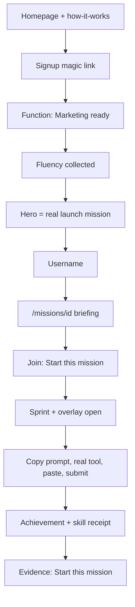

# PRD: Close the Golden Path

**Status:** Draft  
**Author:** Steffan Howey  
**Date:** 2026-08-27  
**Informed by:** Golden-path audit (G1–G28), launch gate verification, `STRATEGY_Foundation.md`  
**Supersedes (partially):** Onboarding handoff sections of `PRD_Onboarding.md` where they conflict with launch catalog reality  
**Related:** `PRD_Onboarding.md`, `LAUNCH_GATE_RESULT.md`, `lib/launchMissionContent.ts`, `lib/missions/config/rollout.ts`

---

## 1. Problem

SkillGap’s first session is supposed to be:

**Land → understand the product → pick who you are → start one mission → do real work in a real tool → get proof you can share.**

The spine underneath that story is real: magic-link auth, a four-step onboarding wizard, mission briefings, real-tool Do missions, persistent rooms, progress persistence, and public evidence pages. What is broken is **sequencing, honesty, and proof integrity** — not missing infrastructure.

### 1.1 Where the story is false today

| # | Break | Evidence |
|---|-------|----------|
| 1 | Homepage cannot explain the product | “See how it works” links to `#how-it-works` in `app/(marketing)/page.tsx`; that section does not exist |
| 2 | Accepting a first path does not open it | `app/onboard/page.tsx` stores `fp_onboarding_picks.id` on `recommended_first_path_id` and routes to `/missions?q=path_topic`. `MissionsPage` never reads the recommendation |
| 3 | Onboarding over-promises coverage | Wizard offers 7 functions × 4 fluencies; live catalog is 5 `mission_projection` paths for **Marketing × Practicing** only (`MISSION_ROLLOUT_CONFIG`, `APPROVED_LAUNCH_ORDER`) |
| 4 | “Start in Room” is not “start the mission” | Mission overlay mounts only when `phase === "sprint"` in `app/environment/[id]/page.tsx`. Join modal re-picks mission and duration first |
| 5 | Proof can be minted without work | Skip on a one-item Do mission completes the path. `/api/learn/evaluate` is unauthenticated and fail-open as `quality: "good"` |

### 1.2 The job of the first session

| Metric | Target |
|--------|--------|
| Time from email to mission briefing open | < 3 minutes |
| First mission completion | One Do item with submitted work and AI evaluation |
| Receipt integrity | Skill receipt only when evaluation exists on a completed Do |
| Share loop | Anonymous viewer can start the same mission via evidence page CTA |

### 1.3 Locked product decision

**Constrain onboarding to the live catalog.** Marketing is the only function selectable as “ready.” Other functions are visible but disabled (“Coming soon”). Fluency is still collected for future personalization. Expanding catalog coverage to seven functions is a **later PRD**, not this one.

---

## 2. Goals

### 2.1 In scope (this PRD)

- A Marketing user walks homepage → signup → onboard → **that mission’s briefing** → room overlay → submit work → receipt → shareable evidence, without dead ends.
- Copy and metadata match the live catalog (duration, step count, tools, title).
- Proof cannot be minted by Skip or fail-open evaluation.
- First-session drop-off is measurable via first-party `/api/events`.
- Auth and cost holes on the path (`/environment`, `/api/learn/evaluate`) are closed.
- Thin fixes for settings, evidence CTA, logo mark, skill tags on cards, search empty-state recovery.

### 2.2 Success criteria

| Criterion | How we know |
|-----------|-------------|
| Golden path completes end-to-end | Manual browser walk: Marketing onboard → mission → room → submit → receipt |
| No dead homepage CTA | “See how it works” scrolls to a real section |
| Onboarding stores path UUID | `fp_profiles.recommended_first_path_id` = `fp_learning_paths.id` |
| Skip cannot complete launch mission | PATCH never sets `status=completed` on skip-only Do |
| Evaluate is protected | Unauthenticated POST returns 401 |
| Environment is protected | Unauthenticated `/environment/[id]` redirects to login |
| Evidence share converts | Logged-out CTA lands on signup with `next=/missions/{path_id}` |

---

## 3. Non-goals

These audit items are **explicitly deferred** to later PRDs. They must not block this work.

| Audit ID | Deferred work | Notes |
|----------|---------------|-------|
| G4 (remainder) | Catalog for Engineering, Design, Product, Data, Sales, Ops | Requires mission publish pipeline per function |
| G19 | On-demand curriculum generation on Missions home | `LearnPage` / `usePathGeneration` exist but are orphaned |
| G21 (remainder) | Skill graph, adjacencies, dedicated `/skills` hub | Profile tab is sufficient for launch |
| G22 | Billing, teams, sitemap, public path SEO, eight growth loops | `PRICING_STRATEGY.md` is docs-only |
| G23 | Heat-driven auto-publish of missions | Blueprints stay editorial (`fp_room_blueprints` queue) |
| G24 (remainder) | Pulse/Index as homepage acquisition engine | Optional footer link only |
| G27 (remainder) | Heartbeat / Pulse / Spike as named room layers | Strategy-only today |
| G28 (remainder) | PostHog / GA / Vercel Analytics vendor install | First-party events table only in this PRD |
| — | Welcome email after signup | No Resend/SendGrid in repo |
| — | Full environment simplification | 2,700-line room page stays; mission-first wiring only |
| — | `fp_` table rename / FocusParty rebrand completion | Logo mark swap only |

---

## 4. Design principles

1. **Promise only what is provisioned.** If a function has no published launch mission, it is not selectable as “ready.”
2. **The accepted path is the next URL.** No search dump, no “browse and hope.”
3. **Mission is the object; room is the venue.** Join UI must not re-ask what they already chose.
4. **Skip is exit, not complete.** Especially on Do tasks.
5. **Receipts are evidence.** No evaluated Do → no demonstrated-skill receipt.
6. **Fail closed on eval.** Network/LLM failure is “could not evaluate,” never quality `good`.
7. **Extend, don’t rewrite.** Launch catalog, rooms, overlay, `MissionViewer` stay. Fix wiring.

---

## 5. Target first-session flow

### 5.1 Happy path (Marketing user)



### 5.2 Contrast with today

| Step | Today | Target |
|------|-------|--------|
| Homepage | Hero only; dead `#how-it-works` | Three-beat explainer section |
| Onboarding path pick | Fake modules/time; random “N learning now” | Data from `LearningPath` row |
| Post-wizard redirect | `/missions?q=path_topic` | `/missions/{path_id}` |
| Missions home | Search mode hides launch catalog | Hero “Your first mission” from `recommended_first_path_id` |
| Start in Room | Join modal + mission re-pick + wait for sprint | Preselected mission; overlay opens on join |
| Do step | Skip completes 1-item mission | Skip blocked on Do; “Leave mission” instead |
| Receipt | Minted on skip | Requires evaluation on completed Do |
| Evidence CTA | `/missions` (auth wall) | `/signup?next=/missions/{path_id}` |

---

## 6. Launch allowlist

### 6.1 Function gating

| Function | Onboarding UI | First mission |
|----------|---------------|---------------|
| **marketing** | Enabled, selectable | One of five published launch paths |
| engineering | Visible, disabled, “Coming soon” | — |
| design | Visible, disabled, “Coming soon” | — |
| product | Visible, disabled, “Coming soon” | — |
| data_analytics | Visible, disabled, “Coming soon” | — |
| sales_revenue | Visible, disabled, “Coming soon” | — |
| operations | Visible, disabled, “Coming soon” | — |

**Legacy users** with non-marketing `primary_function`: show one-line on Missions hero — “Launch missions are currently built for marketers. You can still do them.” Do not block access.

### 6.2 Published launch catalog (as of launch gate)

Five missions from `GET /api/missions/catalog`, `generation_engine = mission_projection`:

| Lane key | Topic |
|----------|-------|
| `prompt-engineering:research-insight` | Prompt Engineering — research brief |
| `prompt-engineering:positioning-messaging` | Prompt Engineering — messaging matrix |
| `claude-code:research-insight` | Claude Code — research brief |
| `claude-code:positioning-messaging` | Claude Code — messaging |
| `github-copilot:research-insight` | GitHub Copilot — research brief |

Order for front door: `APPROVED_LAUNCH_ORDER` in `lib/launchFrontDoor.ts`.

Six launch rooms: Messaging Lab, Research Room, Campaign Sprint, Content Systems, Workflow Studio, Open Studio (`lib/launchRooms.ts`).

### 6.3 Fluency → recommendation mapping

Fluency is collected for all four levels. Hero pick is always a **published catalog path**, not a generated curriculum.

| Fluency | Default hero lane | Also-for-you |
|---------|-------------------|--------------|
| exploring | `prompt-engineering:research-insight` | Up to 2 others from catalog by sort order |
| practicing | `prompt-engineering:research-insight` | Remaining catalog paths |
| proficient | `prompt-engineering:research-insight` | Same catalog; copy does not claim “advanced agentic workflows” |
| advanced | `prompt-engineering:research-insight` | Same catalog; honest “current launch missions” framing |

Editorial can override hero per fluency in `fp_onboarding_picks` once `path_id` is wired.

### 6.4 Honesty rules for onboarding copy

| Field | Source | Never use |
|-------|--------|-----------|
| Title | `fp_learning_paths.title` | `SEED_PICKS.display_title` if it diverges |
| Description | Path / launch mission content | Generic seed description |
| Duration | `estimated_duration_seconds` on path | `SEED_PICKS.time_estimate_min` |
| Step count | `path.items.length` | `SEED_PICKS.module_count` (launch missions are Do-only → “1 step”) |
| Tools | `path.primary_tools` or mission briefing tool | Static seed tool list |
| Social proof | Real presence if we have it | `Math.random() * 23 + 8` in `PathRecommendationStep` |

---

## 7. Functional requirements by surface

### 7.1 Homepage — G1, G13

**Files:** `app/(marketing)/page.tsx`

**G1 — Implement `#how-it-works`**

Add a section below the hero with `id="how-it-works"`. Three beats, left-to-right or stacked on mobile:

| Beat | Headline | Body (1–2 sentences) |
|------|----------|----------------------|
| 1 — Mission | Do real work in real tools | Structured missions with prompts, success criteria, and AI feedback — not passive videos. |
| 2 — Room | Sprint with others | Join a live room, set a timer, and practice alongside professionals doing the same thing. |
| 3 — Proof | Earn verifiable evidence | Complete a mission and get a skill receipt you can share — proof of what you demonstrated. |

Visual: forest/cream brand tokens from existing homepage. No new hex outside `BRAND` constant pattern already used.

Secondary CTA “See how it works” must smooth-scroll to this section (native `href="#how-it-works"` is sufficient if section exists).

**G13 — Logged-in redirect**

Keep existing middleware behavior: authenticated `/` → `/missions`. No logged-in marketing view required.

**Acceptance**

- [ ] Click “See how it works” reveals three beats without page error
- [ ] Section has `id="how-it-works"`
- [ ] Anonymous user sees full homepage; logged-in user hitting `/` goes to `/missions`

**Optional (G24 thin):** Footer link to `/pulse` only if `fp_skill_market_state` has rows. Omit if empty. No Pulse rebuild.

---

### 7.2 Signup / identity — G25 (partial)

**Files:** `app/(auth)/signup/page.tsx`, `app/onboard/page.tsx`, `lib/username.ts`

Keep first name, last name, email, magic link OTP.

**Username skip:** Replace `generateTempHandle()` (`user_${rand}`) with collision-safe handle:

- Base: first name from signup metadata, lowercased, `[a-z0-9_]` only, max 12 chars
- Suffix: 4-char random alphanumeric if collision
- Must pass `useUsernameValidation` rules (min length 3)

**Out of scope:** Welcome email (no email provider in repo).

**Acceptance**

- [ ] Skip username does not produce `user_` prefix handles on evidence pages
- [ ] Generated handle is unique or retries with suffix

---

### 7.3 Onboarding wiring — G2, G3, G4, G9, G26

**Files:** `app/onboard/page.tsx`, `app/onboard/steps/FunctionStep.tsx`, `app/onboard/steps/PathRecommendationStep.tsx`, `lib/onboarding/picks.ts`, `lib/onboarding/types.ts`, `app/api/admin/seed-onboarding-picks/route.ts`, `components/missions/MissionsPage.tsx`

#### 7.3.1 Data model

See **Appendix A** for SQL. Summary:

- Add `fp_onboarding_picks.path_id UUID REFERENCES fp_learning_paths(id)`
- `recommended_first_path_id` on `fp_profiles` must store **path UUID**, never pick row id
- Seed Marketing picks with `path_id` resolved from `mission_lane_key`

#### 7.3.2 `fetchOnboardingPicks`

Update `lib/onboarding/picks.ts`:

- Join `fp_onboarding_picks` → `fp_learning_paths` on `path_id`
- Return hero + also picks with live path metadata
- Filter: `function = marketing` only for launch
- Fallback if no rows: return `{ hero: null, also: [] }` → honest empty UI

#### 7.3.3 `PathRecommendationStep`

- Remove `socialCount` random state
- Render title, description, duration, step count, tools from joined path
- Do-only path: show “1 step · ~N min” not “4 modules”
- Empty state: “Launch missions are being prepared” + Browse → `/missions`

#### 7.3.4 `FunctionStep`

- Marketing: enabled, single-tap advance
- All others: disabled card, badge “Coming soon”, no advance on tap
- Remove or hide multi-select for launch (Marketing-only)

#### 7.3.5 `completeOnboarding`

When `selectedPick` is set:

```typescript
updates.recommended_first_path_id = selectedPick.path_id; // NOT selectedPick.id
router.push(`/missions/${selectedPick.path_id}`);
```

When browse (no pick):

```typescript
router.push("/missions"); // no ?q=
```

Remove `?q=${encodeURIComponent(selectedPick.path_topic)}` entirely.

#### 7.3.6 `MissionsPage`

- Read `profile.recommended_first_path_id` via `useProfile`
- If set, path not completed, and user has not dismissed hero: show Launchpad hero “Your first mission” linking to `/missions/{id}`
- Hero persists until path completed or user starts another mission
- **G26:** When `?q=` is present and search returns 0 results, show “Clear search” control that resets query and reveals launch front door (`buildLaunchFrontDoorBuckets`). Do not leave user in empty search-only view

**Acceptance**

- [ ] Marketing + any fluency → Start learning → URL is `/missions/{uuid}`
- [ ] `fp_profiles.recommended_first_path_id` equals `fp_learning_paths.id`
- [ ] No `?q=` in onboarding redirect
- [ ] Non-marketing functions cannot complete wizard as “ready”
- [ ] Path card shows real step count and duration
- [ ] No fabricated “N learning now”

---

### 7.4 Mission → room — G5, G18

**Files:** `components/missions/MissionDetailPage.tsx`, `components/party/JoinRoomModal.tsx`, `app/environment/[id]/page.tsx`, `lib/missionRoomEntry.ts`, `lib/missionRoomHandoff.ts`

#### 7.4.1 When `missionId` is in URL or handoff

From briefing “Start in Room” → `prepareMissionRoomEntry` sets query params + sessionStorage handoff.

**JoinRoomModal changes:**

- If `missionId` present (URL param or `readMissionRoomHandoff()`): preselect mission, hide `MissionSelectionPicker` or show read-only title
- Primary button label: **Start this mission** (not generic “Join Session”)
- Duration pills remain; default 25 minutes

**Environment page changes:**

- On `handleJoinFromModal` when handoff includes `missionId`:
  - Set `phase = "sprint"` (or equivalent start sprint)
  - Set `missionWorkspaceOpen = true` in same synchronous turn
  - Do not require user to find overlay manually after join

#### 7.4.2 G18 scope limit

Do **not** refactor `app/environment/[id]/page.tsx` architecture. With active mission:

- Do not auto-open breaks flyout
- Do not require separate goal/task selection before overlay
- Optional follow-up: reduce visual prominence of non-mission chrome (not required for P0)

**Acceptance**

- [ ] From briefing, one modal, one click → overlay visible with Do step
- [ ] No second mission picker when arriving with `missionId`
- [ ] Sprint phase active when overlay opens

---

### 7.5 Do / Skip / receipt — G6, G15, G16, G20

**Files:** `components/learn/MissionViewer.tsx`, `lib/useLearnProgress.ts`, `app/api/learn/paths/[id]/route.ts`, `lib/skills/receiptCalculator.ts`, `lib/learn/toolRegistry.ts`

#### 7.5.1 Skip behavior (G6)

| Task type | Skip behavior |
|-----------|---------------|
| watch | Advance without marking `completed: true` OR close overlay; does not increment `items_completed` |
| check | Same |
| reflect | Same |
| **do** | **No skip-to-complete.** Replace Skip with **Leave mission** → closes overlay, no PATCH completion |

**Path completion rule:** `status = completed` only when every item in `path.items` has `item_states[key].completed === true` and `skipped !== true` for Do items.

**PATCH handler:** Reject or ignore completion PATCH that marks Do complete with `{ skipped: true }` for purposes of `items_completed` count.

#### 7.5.2 Receipt rules (G15)

In `calculateSkillReceipt` and completion handler:

- Require ≥1 Do item with `completed: true` AND `evaluation.quality` present (or numeric score > 0)
- Skip-only or unevaluated completion: may write `fp_learning_progress.status = completed` only if product decision is to block completion entirely (preferred: **do not mark path completed** without evaluated Do)
- **Preferred launch behavior:** path cannot reach `completed` without evaluated Do → no achievement, no receipt

If `fp_skill_tags` empty for path:

- Log `[skill-receipt] No skill tags for path`
- Show completion UI: “Mission complete” without skill levels
- Admin alert / pipeline check for catalog paths

**Launch seed work:** Ensure all 5 catalog paths have `fp_skill_tags` rows (Appendix B).

#### 7.5.3 Tool deep links (G16)

In `MissionViewer.handleCopyAndOpen`:

```typescript
const url = buildToolUrl(tool.slug, mission.tool_prompt) ?? tool.url;
window.open(url, "_blank", "noopener,noreferrer");
```

If clipboard write fails, show persistent inline prompt text; do not auto-advance to “working” phase implying copy succeeded.

#### 7.5.4 Evaluation persistence (G20)

On successful submit in `MissionViewer`:

- `completeItem` must PATCH with `item_state` including `evaluation` from `/api/learn/evaluate` response
- Optionally include `submission` text for server-side re-eval (PATCH already supports this)
- Do not run conflicting numeric evaluator if client already sent quality mapping

**Acceptance**

- [ ] Skip on Do does not set `fp_learning_progress.status = completed` for 1-item launch mission
- [ ] Submit with paste → evaluation in `item_states` → receipt in `fp_achievements.skill_receipt`
- [ ] `fp_user_skills` updated when receipt issued
- [ ] v0 deep link used when template exists in `toolRegistry`
- [ ] Catalog paths have skill tags (verify via SQL)

---

### 7.6 Evaluate + environment auth — G7, G8, G14

**Files:** `app/api/learn/evaluate/route.ts`, `lib/supabase/middleware.ts`, `app/api/admin/seed-topic-skill-map/route.ts`

#### 7.6.1 Evaluate auth (G7)

At start of `POST`:

```typescript
const supabase = await createServerClient();
const { data: { user } } = await supabase.auth.getUser();
if (!user) return NextResponse.json({ error: "Unauthorized" }, { status: 401 });
```

Rate limit: 30 requests/hour/user (implement via `fp_product_events` count or simple in-memory map keyed by user id with TTL — document choice in implementation).

**Fail closed:** On catch, return:

```json
{ "error": "Evaluation unavailable", "quality": "unevaluated" }
```

Status 503. Never return `DEFAULT_RESPONSE` with `quality: "good"` on error.

**MissionViewer:** If `quality === "unevaluated"` or 503, show retry UI; do not offer “Complete anyway.”

#### 7.6.2 Environment auth (G8)

Add to `PROTECTED_PREFIXES` in `lib/supabase/middleware.ts`:

```typescript
"/environment",
```

Keep `/i/` and `/join/` public entry points that redirect unauthenticated users to `/login?next=...`.

#### 7.6.3 Seed topic-skill-map (G14)

Replace auth-any-user with `requireAdmin()` or `x-admin-secret` header check, matching `app/api/admin/seed-onboarding-picks/route.ts`.

**Acceptance**

- [ ] `curl -X POST /api/learn/evaluate` without session → 401
- [ ] Logged-out GET `/environment/{id}` → redirect `/login?next=...`
- [ ] Non-admin POST `/api/admin/seed-topic-skill-map` → 401/403

---

### 7.7 Evidence share — G11

**Files:** `app/(public)/progress/evidence/[id]/page.tsx`, `lib/appRoutes.ts`

Primary CTA copy: **Start this mission**

Link:

```
/signup?next=/missions/{achievement.path_id}
```

If viewer has session, link can be `/missions/{path_id}` directly.

Secondary CTA: SkillGap home `/`.

Remove or replace current “Build your own capability record” → `/missions` (auth-gated, no context).

**Acceptance**

- [ ] Logged-out click on evidence CTA → signup with correct `next` param
- [ ] After auth, user lands on mission briefing for shared path

---

### 7.8 Settings — G12

**Files:** `app/(hub)/settings/page.tsx`, new `components/settings/SettingsPage.tsx` (or inline)

**MVP fields:**

| Field | Source | Editable |
|-------|--------|----------|
| Display name | `fp_profiles.display_name` | Yes |
| Username | `fp_profiles.username` | Yes, with validation |
| Email | `fp_profiles.email` | Read-only |
| Sign out | Auth provider | Button |

No notifications, billing, integrations, or avatar editor in this PRD.

**Acceptance**

- [ ] `/settings` renders form, not empty main
- [ ] Display name save persists to `fp_profiles`
- [ ] Sign out works

---

### 7.9 Analytics — G10, G28 (partial)

**Files:** new `app/api/events/route.ts`, `lib/onboarding/tracking.ts`, migration SQL Appendix A

**Table:** `fp_product_events`

| Column | Type | Notes |
|--------|------|-------|
| id | uuid PK | `gen_random_uuid()` |
| user_id | uuid nullable FK | Null for anonymous homepage events |
| event | text | e.g. `onboarding_completed` |
| properties | jsonb | `{ timestamp, ... }` |
| created_at | timestamptz | default now() |

**POST /api/events:**

- Accept `{ event, properties }`
- Attach `user_id` from session if present
- Insert row; return 204
- Never throw to client (tracking stays fire-and-forget)

**New events to instrument:**

| Event | When |
|-------|------|
| `first_mission_opened` | Mission briefing mount with `recommended_first_path_id` |
| `mission_started_in_room` | Join modal confirm with missionId |
| `mission_submitted` | Do submit with evaluation request |
| `mission_skipped_blocked` | User attempts skip on Do (if we log attempts) |
| `mission_completed` | Path status completed with evaluation |
| `receipt_issued` | Achievement created with skill_receipt |

Existing onboarding events in `tracking.ts` already call `/api/events` — they will start working once route exists.

**Acceptance**

- [ ] POST `/api/events` returns 204, row in `fp_product_events`
- [ ] Onboarding complete creates event row
- [ ] Mission complete creates event row

---

### 7.10 Identity — G17

**Files:** `components/shell/Logo.tsx`, `public/logo/`

Replace `LOGO_MARK = "/logo/focusparty_logo_mark.png"` with SkillGap mark from `public/logo/` (use existing skillgap asset or add mark file).

No `fp_` table renames.

**Acceptance**

- [ ] Small logo variant shows SkillGap mark in nav/shell

---

### 7.11 Skills on path — G21 (thin)

**Files:** `components/missions/MissionCard.tsx`, `components/missions/MissionDetailPage.tsx`, `lib/skills/pathSkillTags.ts`

Display skill tags on mission cards and briefing header when `path.skill_tags` or loaded tags exist.

No `/skills` hub. No adjacency engine.

**Acceptance**

- [ ] Launch mission cards show 1–3 skill pills when tags exist

---

### 7.12 Room → path — G27 (thin)

**Files:** `components/missions/MissionCompletionSummary.tsx`

Keep existing post-completion mission recommendations. No AI host “go official” path suggestion. No Spike events.

**Acceptance**

- [ ] After completion, user sees next catalog mission recommendation (existing behavior preserved)

---

## 8. Audit traceability matrix (G1–G28)

| ID | Sev | Layer | Disposition | Requirement summary | Primary files | Acceptance |
|----|-----|-------|-------------|---------------------|---------------|------------|
| G1 | Blocker | FE | **Fix** | Add `#how-it-works` section | `app/(marketing)/page.tsx` | Secondary CTA scrolls to real content |
| G2 | Blocker | Both | **Fix** | Onboarding stores path UUID, redirects to `/missions/{id}` | `app/onboard/page.tsx`, picks | No `?q=` redirect |
| G3 | Blocker | FE | **Fix** | Missions honors `recommended_first_path_id` hero | `MissionsPage.tsx`, `useProfile` | Hero shows until path started/completed |
| G4 | Blocker | Both | **Fix (partial)** | Marketing-only selectable; others coming soon | `FunctionStep.tsx` | Non-marketing cannot finish as ready |
| G4 | Blocker | Both | **Defer** | Catalog for all 7 functions | — | Later PRD |
| G5 | High | FE | **Fix** | Join → sprint + overlay; no mission re-pick | `JoinRoomModal`, `environment/[id]` | One click to Do step |
| G6 | High | Both | **Fix** | Skip cannot complete Do / 1-item mission | `MissionViewer`, PATCH route | Skip leaves progress incomplete |
| G7 | High | BE | **Fix** | Auth + rate limit + fail-closed evaluate | `api/learn/evaluate/route.ts` | 401 unauth; 503 on error |
| G8 | High | BE | **Fix** | Protect `/environment` in middleware | `lib/supabase/middleware.ts` | Redirect to login |
| G9 | High | FE | **Fix** | Remove fake social proof; honest path metadata | `PathRecommendationStep.tsx` | No random counts |
| G10 | High | BE | **Fix** | Implement `/api/events` | new route, SQL | Events persist |
| G11 | High | FE | **Fix** | Evidence CTA → signup with mission next | `progress/evidence/[id]/page.tsx` | Logged-out lands on briefing |
| G12 | High | FE | **Fix** | Settings MVP | `settings/page.tsx` | Non-empty settings UI |
| G13 | High | FE | **Fix (partial)** | Keep auth redirect; add how-it-works for anonymous | `page.tsx`, middleware | Logged-in `/` → missions |
| G14 | High | BE | **Fix** | Admin-gate seed-topic-skill-map | `seed-topic-skill-map/route.ts` | Non-admin 401 |
| G15 | High | Both | **Fix** | Receipt requires tags + evaluated Do | `receiptCalculator.ts`, seed SQL | Receipt or honest no-skill UI |
| G16 | High | FE | **Fix** | Use `buildToolUrl`; clipboard fail UX | `MissionViewer.tsx` | Deep link when available |
| G17 | Medium | FE | **Fix** | SkillGap logo mark | `Logo.tsx` | No focusparty mark |
| G18 | Medium | FE | **Fix (scoped)** | Mission-first join; no break auto-open | `environment/[id]` | Overlay without extra ritual |
| G19 | Medium | Both | **Defer** | On-demand path generation on Missions | `LearnPage`, `usePathGeneration` | Later PRD |
| G20 | Medium | Both | **Fix** | Persist evaluation on completeItem | `useLearnProgress`, PATCH | item_states has quality |
| G21 | Medium | Both | **Fix (thin)** | Skill pills on cards/briefing | `MissionCard`, tags loader | Tags visible |
| G21 | Medium | Both | **Defer** | Skill graph, adjacencies, `/skills` hub | — | Later PRD |
| G22 | Medium | Both | **Defer** | Growth loops, billing, SEO, teams | — | Later PRD |
| G23 | Medium | BE | **Defer** | Heat → auto-publish missions | pipeline | Editorial queue stays |
| G24 | Medium | Both | **Fix (thin)** | Optional Pulse footer link | marketing page | Link only if data exists |
| G24 | Medium | Both | **Defer** | Pulse as acquisition engine | — | Later PRD |
| G25 | Medium | FE | **Fix (partial)** | Better skip username | `onboard/page.tsx` | No `user_` handles |
| G26 | Medium | FE | **Fix** | Clear search reveals catalog | `MissionsPage.tsx` | Empty search recoverable |
| G27 | Medium | Both | **Fix (thin)** | Keep completion recommendations | `MissionCompletionSummary` | Next mission shown |
| G27 | Medium | Both | **Defer** | Heartbeat/Pulse/Spike layers | — | Strategy only |
| G28 | Medium | BE | **Fix (partial)** | First-party events table | `/api/events` | Funnel measurable |
| G28 | Medium | BE | **Defer** | PostHog/GA install | — | Later PRD |

---

## 9. Data model & SQL appendix

> **Run manually in Supabase.** Do not use Supabase MCP (wrong project).

### Appendix A — Schema changes

```sql
-- A1. Link onboarding picks to real learning paths
ALTER TABLE fp_onboarding_picks
  ADD COLUMN IF NOT EXISTS path_id UUID REFERENCES fp_learning_paths(id);

CREATE INDEX IF NOT EXISTS idx_onboarding_picks_path_id
  ON fp_onboarding_picks(path_id);

-- A2. Product events for first-party analytics
CREATE TABLE IF NOT EXISTS fp_product_events (
  id UUID PRIMARY KEY DEFAULT gen_random_uuid(),
  user_id UUID REFERENCES auth.users(id) ON DELETE SET NULL,
  event TEXT NOT NULL,
  properties JSONB NOT NULL DEFAULT '{}'::jsonb,
  created_at TIMESTAMPTZ NOT NULL DEFAULT now()
);

CREATE INDEX IF NOT EXISTS idx_product_events_user_created
  ON fp_product_events(user_id, created_at DESC);

CREATE INDEX IF NOT EXISTS idx_product_events_event_created
  ON fp_product_events(event, created_at DESC);

-- RLS: users can insert their own events; service role reads all
ALTER TABLE fp_product_events ENABLE ROW LEVEL SECURITY;

CREATE POLICY product_events_insert_own ON fp_product_events
  FOR INSERT TO authenticated
  WITH CHECK (user_id = auth.uid() OR user_id IS NULL);

CREATE POLICY product_events_insert_anon ON fp_product_events
  FOR INSERT TO anon
  WITH CHECK (user_id IS NULL);
```

### Appendix B — Seed onboarding picks to catalog paths

Run after catalog is published. Resolve path IDs by lane key:

```sql
-- Example: wire marketing practicing hero to prompt-engineering research brief
-- Repeat for each pick row; adjust IDs from your environment.

UPDATE fp_onboarding_picks op
SET path_id = lp.id
FROM fp_learning_paths lp
WHERE op.function = 'marketing'
  AND op.fluency_level = 'practicing'
  AND op.sort_order = 0
  AND lp.mission_lane_key = 'prompt-engineering:research-insight'
  AND lp.generation_engine = 'mission_projection'
  AND lp.is_cached = true;

-- Verify
SELECT op.id, op.function, op.fluency_level, op.sort_order,
       op.path_id, lp.title, lp.mission_lane_key
FROM fp_onboarding_picks op
LEFT JOIN fp_learning_paths lp ON lp.id = op.path_id
WHERE op.function = 'marketing';
```

### Appendix C — Verify catalog skill tags

```sql
SELECT lp.id, lp.title, lp.mission_lane_key,
       COUNT(st.skill_id) AS tag_count
FROM fp_learning_paths lp
LEFT JOIN fp_skill_tags st ON st.path_id = lp.id
WHERE lp.generation_engine = 'mission_projection'
  AND lp.is_cached = true
GROUP BY lp.id, lp.title, lp.mission_lane_key
ORDER BY lp.title;
```

If `tag_count = 0` for any launch path, insert tags via admin tooling or manual SQL referencing `fp_skills` slugs appropriate to the mission (e.g. `prompt-engineering`, `writing-communication`).

### Appendix D — Verify launch rooms exist

```sql
SELECT id, name, launch_room_key, persistent, status, launch_visible
FROM fp_parties
WHERE launch_visible = true
   OR launch_room_key IS NOT NULL
ORDER BY name;
```

Expect 6 launch-visible rooms per `LAUNCH_GATE_RESULT.md`.

---

## 10. Implementation phases

### Phase P0 — Golden path integrity (ship blockers)

| Order | Work item | Audit IDs |
|-------|-----------|-----------|
| 1 | Homepage `#how-it-works` | G1, G13 |
| 2 | Function gating (Marketing only) | G4 |
| 3 | `path_id` on picks + onboarding redirect to `/missions/{id}` | G2, G3, G9 |
| 4 | Missions hero from `recommended_first_path_id` | G3 |
| 5 | Honest path metadata in PathRecommendationStep | G9 |
| 6 | Skip / completion / receipt rules | G6, G15, G20 |
| 7 | Catalog skill tags verified/seeded | G15 |
| 8 | Join → overlay in one flow | G5, G18 |
| 9 | Evaluate auth + fail-closed | G7 |
| 10 | Environment middleware auth | G8 |
| 11 | seed-topic-skill-map admin gate | G14 |

**P0 exit criteria:** Marketing user completes one launch mission with submission and receipt; skip cannot complete; unauth evaluate/environment blocked.

### Phase P1 — Polish & measurement

| Order | Work item | Audit IDs |
|-------|-----------|-----------|
| 1 | Evidence page CTA with `next` param | G11 |
| 2 | Settings MVP | G12 |
| 3 | `/api/events` + instrumentation | G10, G28 |
| 4 | Username skip improvement | G25 |
| 5 | Tool deep links | G16 |
| 6 | Logo mark swap | G17 |
| 7 | Skill pills on mission cards | G21 |
| 8 | Search clear-to-catalog | G26 |
| 9 | Optional Pulse footer link | G24 |

**P1 exit criteria:** Share loop works for logged-out viewer; settings usable; events queryable; visual polish complete.

---

## 11. Test plan

### 11.1 Automated

| Test | File / approach |
|------|-----------------|
| Onboarding redirect builds `/missions/{pathId}` | Unit test `completeOnboarding` or integration |
| Skip on Do does not increment completion | `MissionViewer` + PATCH contract test |
| Evaluate 401 without auth | `app/api/learn/evaluate/route.test.ts` |
| Receipt skipped without evaluation | `receiptCalculator.test.ts` or skill-loop contract |
| Middleware protects `/environment` | Route test or middleware unit test |

Extend existing patterns in `app/api/learn/skill-loop.contract.test.ts`, `app/api/learn/paths/[id]/route.test.ts`.

### 11.2 Manual browser (required before launch)

Use real magic-link OTP. Dev server at `http://localhost:3000`.

| # | Step | Expected |
|---|------|----------|
| 1 | Visit `/` logged out | Hero + how-it-works visible after scroll |
| 2 | Signup → onboard Marketing + Practicing | Function grid shows coming soon on others |
| 3 | Accept hero path | Lands `/missions/{uuid}` briefing, not search |
| 4 | Start in Room | Join modal shows mission; one click → overlay with Do |
| 5 | Copy prompt, open tool, paste, submit | Evaluation feedback shown |
| 6 | Complete | Receipt + achievement; Profile shows evidence |
| 7 | Try Skip on Do (if still exposed) | Does not complete mission |
| 8 | Share evidence URL logged out | CTA → signup with `next` to same mission |
| 9 | `/settings` | Edit display name saves |
| 10 | curl evaluate without cookie | 401 |
| 11 | `/environment/{id}` logged out | Redirect login |

### 11.3 SQL verification after test user completes mission

```sql
SELECT user_id, path_id, status, items_completed, items_total, completed_at
FROM fp_learning_progress
ORDER BY last_activity_at DESC LIMIT 5;

SELECT user_id, path_id, completed_at, (skill_receipt IS NOT NULL) AS has_receipt
FROM fp_achievements
ORDER BY completed_at DESC LIMIT 5;

SELECT event, properties->>'path_id' AS path_id, created_at
FROM fp_product_events
WHERE event IN ('onboarding_completed', 'mission_completed', 'receipt_issued')
ORDER BY created_at DESC LIMIT 20;
```

**Pass:** One row with `status = completed`, `has_receipt = true`, evaluation present in `item_states` JSONB for Do item.

---

## 12. Rollout & risk

| Risk | Mitigation |
|------|------------|
| `fp_onboarding_picks.path_id` null in prod | Run Appendix B before enabling new onboarding redirect |
| Existing users with pick UUID in `recommended_first_path_id` | One-time migration: null invalid UUIDs or map via picks table |
| Evaluate rate limit too aggressive | Start at 30/hr; log rejections in `fp_product_events` |
| Marketing-only gating frustrates engineers | Clear “Coming soon” + waitlist capture is future work; copy must be honest |
| Room complexity still overwhelms | P0 only wires mission-first; full environment trim is deferred |

**Feature flags:** None required. Launch catalog is already gated by `MISSION_ROLLOUT_CONFIG`. This PRD aligns UX to that gate.

**Rollback:** Revert onboarding redirect to `/missions?q=` only if catalog seed fails — prefer fixing seed over rollback.

---

## 13. Open questions (resolve during implementation)

1. **Block path completion entirely on skip** vs. allow completion with achievement but no receipt — PRD prefers blocking completion without evaluated Do. Confirm with product.
2. **Rate limit storage** — in-memory (serverless caveat: per-instance) vs. `fp_product_events` count query. Prefer DB count for Vercel.
3. **Hero dismiss** — should user be able to dismiss “Your first mission” on Missions home? Default: dismiss persists in localStorage until path started.

---

## 14. File ownership summary

| Area | Files |
|------|-------|
| Marketing | `app/(marketing)/page.tsx` |
| Onboarding | `app/onboard/page.tsx`, `app/onboard/steps/*`, `lib/onboarding/*` |
| Missions home | `components/missions/MissionsPage.tsx`, `lib/useLearnSearch.ts` |
| Mission briefing | `components/missions/MissionDetailPage.tsx` |
| Room join | `components/party/JoinRoomModal.tsx`, `lib/missionRoomEntry.ts` |
| Room runtime | `app/environment/[id]/page.tsx` |
| Do / Skip | `components/learn/MissionViewer.tsx` |
| Progress | `lib/useLearnProgress.ts`, `app/api/learn/paths/[id]/route.ts` |
| Receipt | `lib/skills/receiptCalculator.ts` |
| Evaluate | `app/api/learn/evaluate/route.ts` |
| Auth | `lib/supabase/middleware.ts` |
| Evidence | `app/(public)/progress/evidence/[id]/page.tsx` |
| Settings | `app/(hub)/settings/page.tsx` |
| Analytics | `app/api/events/route.ts`, `lib/onboarding/tracking.ts` |
| Admin | `app/api/admin/seed-onboarding-picks/route.ts`, `seed-topic-skill-map/route.ts` |
| Brand | `components/shell/Logo.tsx` |
| Cards | `components/missions/MissionCard.tsx` |

---

## 15. Document history

| Date | Change |
|------|--------|
| 2026-08-27 | Initial draft from golden-path audit and launch gate |

---

*End of PRD. Implementation begins only after explicit engineering kickoff. Do not auto-publish rooms. Do not use Supabase MCP for migrations.*
